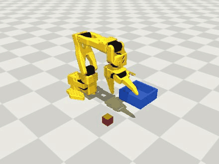
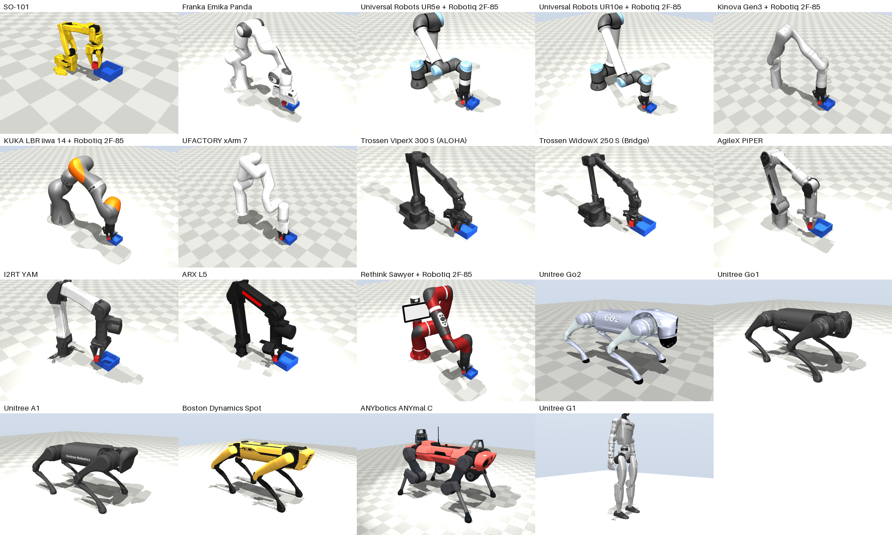
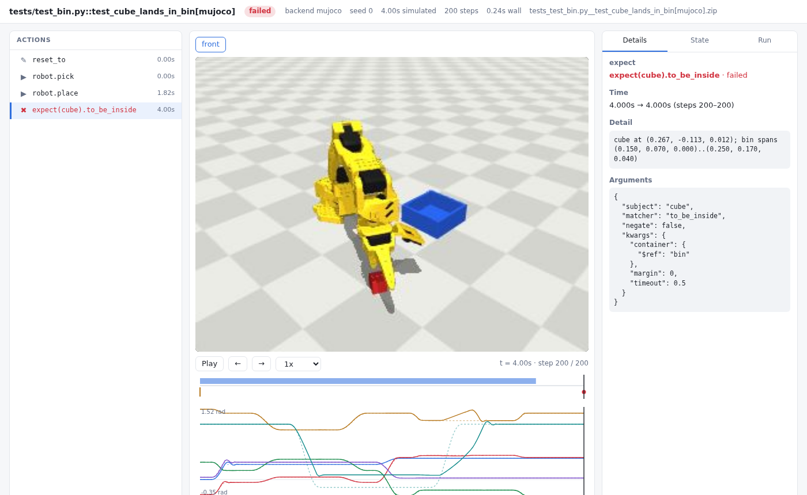

# robowright

**Playwright-style testing for robots.** Write a robot test once, with actions that wait until they're actually done and assertions that retry until the physical world catches up. Run it on **19 robots** (13 arms, 6 legged) across **five physics engines**, and get a trace you can scrub through, a bit-for-bit replay and a generated regression test for every failure.

<p align="center"></p>

```python
from robowright import expect


def test_pick_and_place(robot, scene):
    cube, bin = scene["cube"], scene["bin"]

    robot.pick(cube)
    expect(robot.gripper).to_be_holding(cube)

    robot.place(on=bin)
    expect(cube).to_be_inside(bin)
    expect(cube).to_be_at_rest()
```

```console
$ pytest --rw-robot all --rw-backend mujoco,pybullet,drake,genesis   # 13 arms x 4 engines, same test
```

<p align="center"></p>

The test above runs unchanged on a Franka Panda, a UR5e with a Robotiq gripper, a Kinova
Gen3, a KUKA iiwa, an xArm 7, ALOHA's ViperX, the Bridge WidowX, a PiPER, a YAM, an ARX L5,
a Sawyer and the LeRobot SO-101. Adding a robot is about ten lines: name its arm joints,
hand, finger bodies and gripper actuator. robowright works out the tool axis, tool centre
point, fingertip clearance and gripper calibration from the robot's own model.

> **Status: pre-alpha.** Simulation only. See [Limitations](#limitations).

## Why

Most robot software is tested by running it and watching. The tools that exist each cover
one slice of the problem:

- `launch_testing` checks that processes start and exit.
- Benchmark suites such as LIBERO and ManiSkill score policies on fixed tasks.
- Rerun and Foxglove record and visualise runs, but have no notion of pass or fail.

None of them gives you what web developers have had for years: a test that says what
should happen, waits for it, fails with a clear explanation, and leaves behind enough
evidence to debug it. robowright brings that workflow to robots:

| Playwright | robowright |
|---|---|
| auto-waiting actions | `robot.arm.move_to(...)` returns only once the arm has settled; `gripper.close()` returns once the jaws have stalled |
| web-first assertions | `expect(cube).to_be_inside(bin)` re-checks every control step until it holds or times out, in *simulated* time |
| locators | `scene["cube"]`, `scene.get(color="red")`, `scene.nearest(to=robot.tcp)` are live handles, not snapshots |
| trace viewer | every failure leaves a `.zip` trace with joints, object poses, contacts and the action timeline, viewable as HTML with camera views drawn from it |
| codegen | `robowright codegen trace.zip` rebuilds the exact failing situation as a pytest test |
| projects (browsers) | `--rw-backend mujoco,drake` and `--rw-robot panda,ur5e` run every test on each engine and robot |

On top of that, it adds things robots need and web pages don't:

- **Statistical tests:** a policy that works 92% of the time is normal. `@pytest.mark.trials(20, min_success=0.9)` judges a rate, with confidence intervals.
- **Fault injection:** sensor noise, command latency, weak servos, shoves and camera dropout, all seeded.
- **Invariants:** `expect(robot).always.to_have_no_collisions()` is checked after every step.
- **Deterministic replay:** re-simulates a trace from its recorded motor commands and reports the first step where anything diverges.

## Robots

| name | robot | maker | kind | joints | model licence |
|---|---|---|---|---|---|
| `so101` | SO-101 | TheRobotStudio / Hugging Face | arm | 5 | Apache-2.0 |
| `panda` | Franka Emika Panda | Franka Robotics | arm | 7 | Apache-2.0 |
| `ur5e` | Universal Robots UR5e + Robotiq 2F-85 | Universal Robots | arm | 6 | BSD (arm, gripper) |
| `ur10e` | Universal Robots UR10e + Robotiq 2F-85 | Universal Robots | arm | 6 | BSD (arm, gripper) |
| `gen3` | Kinova Gen3 + Robotiq 2F-85 | Kinova | arm | 7 | BSD (arm, gripper) |
| `iiwa14` | KUKA LBR iiwa 14 + Robotiq 2F-85 | KUKA | arm | 7 | BSD-3-Clause (arm), BSD (gripper) |
| `xarm7` | UFACTORY xArm 7 | UFACTORY | arm | 7 | BSD |
| `vx300s` | Trossen ViperX 300 S (ALOHA) | Trossen Robotics | arm | 6 | BSD |
| `wx250s` | Trossen WidowX 250 S (Bridge) | Trossen Robotics | arm | 6 | BSD |
| `piper` | AgileX PiPER | AgileX Robotics | arm | 6 | MIT |
| `yam` | I2RT YAM | I2RT | arm | 6 | MIT |
| `arx_l5` | ARX L5 | ARX | arm | 6 | BSD-3-Clause |
| `sawyer` | Rethink Sawyer + Robotiq 2F-85 | Rethink Robotics | arm | 7 | Apache-2.0 (arm), BSD (gripper) |
| `go2` | Unitree Go2 | Unitree Robotics | quadruped | 12 | BSD |
| `go1` | Unitree Go1 | Unitree Robotics | quadruped | 12 | BSD-3-Clause |
| `a1` | Unitree A1 | Unitree Robotics | quadruped | 12 | BSD-3-Clause |
| `spot` | Boston Dynamics Spot | Boston Dynamics | quadruped | 12 | BSD-3-Clause |
| `anymal_c` | ANYbotics ANYmal C | ANYbotics | quadruped | 12 | BSD |
| `g1` | Unitree G1 | Unitree Robotics | humanoid | 29 | BSD |

```console
$ robowright robots                              # this list
$ pytest --rw-robot panda,ur5e                   # pick robots
$ pytest --rw-robot all                          # every arm
$ pytest --rw-robot legged                       # every legged robot
```

Models come from [MuJoCo Menagerie](https://github.com/google-deepmind/mujoco_menagerie),
fetched on first use (a sparse checkout of just the robots you run, pinned to one commit),
except the SO-101, which ships with robowright. They keep their own licences. Robots
without a gripper of their own (UR5e, UR10e, Gen3, iiwa, Sawyer) get a Robotiq 2F-85.

Each arm is mounted where its top-down workspace covers the same task area, so a test's
coordinates mean the same thing on every robot. Everything else is derived from the model,
not hand-tuned:

- **Tool axis and TCP:** read from the finger geometry, with the TCP placed where the fingers close.
- **Fingertip clearance:** how low a grasp can go before the fingertips touch the table.
- **Gripper calibration:** every finger joint's open and closed position, plus which joints the
  actuator drives and which follow through a linkage. Engines without MuJoCo's tendons and
  equality constraints need this to move the fingers the same way.

## Legged robots

```python
def test_go2_recovers_from_a_shove(world, robot):
    expect(robot.base).always.to_be_upright(tol_deg=30)  # invariant: never tips over
    world.faults.push("robot", force=(0, 0.3 * robot.total_mass * 9.81, 0), duration=0.1)
    world.wait(1.5)
    expect(robot.base).to_be_upright(tol_deg=10)
    expect(robot.base).to_be_above(0.8 * robot.model.stand_height)
```

`robot.base` is a live handle like any object: position, orientation, velocity, contacts.
`robot.stand()`, `robot.crouch(depth)` and `robot.move_joints(q)` wait until the robot
settles. Policies get what an IMU and joint encoders give a real robot (`base_quat`,
`base_ang_vel`, `qpos`, `qvel`). There is no walking controller built in: walking is a
policy's job, run with `robot.run_policy(...)`. Unitree H1 and Booster T1 are not on the
list because neither can stand on joint servos alone, without a balance controller.

## Install

```bash
git clone https://github.com/JeremiahM37/robowright && cd robowright
pip install -e ".[dev]"          # MuJoCo is required; PyBullet, xdist and ruff come with [dev]
pip install -e ".[drake]"        # optional: Drake (Python 3.12+)
pip install -e ".[genesis]"      # optional: Genesis (install a CPU or CUDA torch first)
pip install -e ".[mcp]"          # optional: the MCP server for AI agents
robowright info                  # versions, backends, and whether offscreen rendering works
robowright robots                # the robots you can test on
pytest examples
```

Robot models other than the SO-101 are downloaded from MuJoCo Menagerie the first time a
test uses them, into `~/.cache/robowright`. It's a sparse checkout of just the robots you
run: 30–40 MB each, mostly meshes.

On a headless Linux machine robowright renders through EGL. Without a working GL, tests
still run and traces are still recorded; the viewer just has no camera view.

**Isaac Sim** (NVIDIA GPU machines only) isn't a pip extra: install Isaac Sim 5.x
(`pip install "isaacsim[all,extscache]==5.1.0" --extra-index-url https://pypi.nvidia.com`
into a Python 3.11 environment), set `OMNI_KIT_ACCEPT_EULA=YES`, then install robowright
into the same environment and use `--rw-backend isaac`. Its URDF importer needs
`libxml2.so.2` (on Arch-based systems, the `libxml2-legacy` package).

## A tour

### Actions wait

```python
robot.arm.move_to((0.22, 0.05, 0.04))  # IK, joint-space trajectory, then wait until settled
robot.arm.move_to(cube, linear=True, speed=0.05)  # straight-line Cartesian approach
robot.gripper.close()  # returns when the jaws stop: on an object, or shut
robot.pick(cube)  # returns once the cube is held in both jaws after the lift
robot.place(on=bin)  # into the bin's centre, or the free spot farthest from what is already there
```

When an action can't finish, it says why:

```
ActionTimeoutError: arm did not settle within 1.0s; worst joint shoulder_lift is 0.408 rad off target
UnreachableError: no joint configuration reaches [0.5, 0.0, 0.3] (closest 264.6 mm)
GraspError: pick('cube2') lifted without it: cube2 is at [0.151, -0.086, 0.012], the tool at [0.161, -0.1, 0.066], the jaws at opening 0.11, touching nothing / nothing
```

### Assertions wait, then explain

```python
expect(cube).to_be_inside(bin)  # retries for up to 2 s of simulated time
expect(cube).to_be_at_rest(hold=0.3)  # ...and must stay true for 0.3 s
expect(robot.gripper).to_be_holding(cube)  # both jaws in contact
expect(cube).not_.to_be_touching("floor")
expect(robot).always.to_have_no_collisions()  # invariant for the rest of the test
expect.soft(cube).to_be_upright()  # record and keep going; fail at the end
```

```
ExpectationError: expect(cube).to_be_inside failed after 2.00s (timeout 2.0s)
  cube at (0.256, -0.102, 0.012); bin spans (0.150, 0.070, 0.000)..(0.250, 0.170, 0.040)
```

Time spent waiting is *simulated* time, so a 2-second timeout costs a few milliseconds of
wall time, and a condition that is already true costs nothing.

Matchers: `to_be_near`, `to_be_inside`, `to_be_above`, `to_have_position`, `to_be_at_rest`,
`to_be_upright`, `to_be_touching`, `to_be_holding`, `to_be_open`, `to_be_closed`,
`to_have_joint`, `to_have_no_collisions`, `to_satisfy(fn)`.

### Policies are first-class

Any callable `obs -> joint targets` is a policy, including action chunks (`(n, 6)` arrays),
which is how ACT- and diffusion-style policies emit actions:

```python
from robowright import condition

done = condition(scene["cube"], "to_be_inside", scene["bin"])
rollout = robot.run_policy(my_policy, until=done, timeout=15, cameras=("front",))
assert rollout.success
```

### Statistics instead of flakes

```python
@pytest.mark.trials(20, min_success=0.9)
def test_policy_with_randomized_cube(world, robot, scene):
    world.faults.jitter("cube", xy_std=0.02, yaw_std=0.5)
    ...
```

```
================================ robowright trials =================================
PASS examples/test_pick_and_place.py::test_policy_with_randomized_cube[mujoco]: 18/18 passed (100%, 95% CI 82%-100%); required rate >= 90% of 20, settled after 18
```

Each trial gets its own seed. A failing trial keeps its own trace, and its seed is printed,
so you can rerun exactly that one. Trials stop once the rest cannot change the verdict
(18 passes of 20 already meet 90%; 3 failures already miss it), so the verdict is always the
one all 20 would give. `--rw-all-trials` runs every one, for a rate measured on all of them.

### Faults

```python
world.faults.joint_noise(std=0.02)  # encoder noise, seen by robot and policy, not by physics
world.faults.action_delay(steps=3)  # 60 ms command latency
world.faults.weak_joint("shoulder_lift", 0.3)  # a tired servo
world.faults.push("cube", force=(0, 1.5, 0), duration=0.1)
world.faults.camera_dropout(p=0.1)
world.faults.jitter("cube", xy_std=0.02)  # domain randomisation, seeded
```

### Traces, replay, codegen

With the default `--rw-trace retain-on-failure`, every failing test leaves a trace:

```
================================ robowright traces =================================
tests/test_bin.py::test_cube_lands_in_bin[mujoco]
    robowright show-trace robowright-traces/tests_test_bin.py__test_cube_lands_in_bin[mujoco].zip
```

<p align="center"></p>

The viewer is one self-contained HTML file, so you can attach it to a CI run or an issue.
It has an action list, a scrubbable camera view, a timeline, joint plots (measured against
commanded), and per-step joints, objects and contacts.

Tests don't render anything while they run. A trace records each step's joints, object
poses and (for legged robots) base pose. When a trace is opened, the scene is rebuilt in
MuJoCo and drawn from that recorded state, with no physics. So only the runs someone
looks at pay for pictures. Rendering frames during a run used to roughly double a test's
time (+80% to +119% on a pick-and-place); recording state alone costs 2–13%. Traces from
engines that can't render, such as Isaac Sim here, are drawn the same way.

```console
$ robowright render trace.zip -o run.mp4 --size 1280x720    # every step, at the run's own pace
```

To keep what the cameras saw during the run instead, for example the images a policy was
given, pass `Settings(trace_cameras=["front"])`.

```console
$ robowright replay trace.zip
replayed 223 steps: bit-identical

$ robowright codegen trace.zip -o tests/test_regression_bin.py
```

`replay` rebuilds the scene, restores the saved simulator state and feeds back the
recorded motor commands and forces. No test code runs. If anything diverges, it reports
the first step where it does. `codegen` writes the run back out as plain robowright code.
That includes the exact randomised start poses and injected faults, so a one-in-fifty
failure becomes a test you can run every time.

### AI agents drive robots over MCP

Playwright MCP lets an agent use a browser. `robowright mcp` lets one use a simulated
robot the same way, then saves what it did as a test.

```console
$ claude mcp add robowright -- robowright mcp
```

The agent launches a world (any robot, any installed engine, its own objects) and reads it
as text:

```
world: Franka Emika Panda (panda) on mujoco, t=6.540s, seed=0, status=running
robot (arm):
  tcp: [0.300, 0.400, 0.166]
  gripper: opening 1.00 (open), holding nothing
  joints: joint1=0.503, joint2=0.711, joint3=0.109, joint4=-1.452, joint5=-0.086, joint6=2.159, joint7=-0.152, gripper=1.000
objects (refs for other calls):
  - cube: red box 40x40x40 mm, at [0.300, 0.401, 0.066], yaw 0 deg, at rest, inside bin, touching bin
  - cylinder: green cylinder 30x30x40 mm, at [0.450, 0.150, 0.020], yaw 0 deg, at rest, touching floor
  - bin: blue bin 200x200x80 mm, at [0.300, 0.400, 0.040], yaw 0 deg, touching cube
cameras: front, top, side
```

It acts on objects by name (`robot_pick`, `robot_place`, `robot_move_to`, `robot_push`,
`robot_fault`, ...), checks outcomes with any matcher (`robot_expect`), and looks through
the cameras (`robot_screenshot`). Each action returns the new snapshot. A failed action
explains itself and the session carries on. `robot_generate_test` writes the session out
as a pytest test that reproduces it bit for bit:

- Attempts that failed during planning, before anything moved, are left out.
- Failed attempts that let simulated time pass are kept inside `pytest.raises`, so the
  rest of the test happens at the same simulated times.

Given only these tools and the task "put a cube and a cylinder in the bin with a Panda,
verify it, save a test", a headless Claude agent built the scene, did it on the first
try, checked a screenshot and saved a test that passes. A session costs what MuJoCo
costs: about 1 second of wall time for a launch, pick, place, check and screenshot.

### Cross-check on another engine

A run that passes on one engine may only pass because of that engine's contact model.
`crosscheck` makes a trace's calls again on another engine, from the same scene and seed,
and compares the verdict and where each object ended up:

Here a WidowX holds a cube, a 1.5 N shove hits it, and the test expects it still held. Its
2.2 N grip lets go in MuJoCo; PyBullet's stiffer contacts keep it:

```console
$ robowright crosscheck widowx_shove.zip --backend pybullet
pybullet: passes; on mujoco it failed
  cube ends 111.0 mm from where it did on mujoco
VERDICTS DIFFER: the outcome depends on the engine
```

The intended workflow:
- Develop and iterate on MuJoCo, where a pick-and-place takes a fraction of a second.
- Cross-check what matters on a heavier engine, such as Isaac Sim's PhysX on a GPU machine.

Agents can do the same with the `robot_crosscheck` MCP tool.

### Several physics engines

```console
$ pytest --rw-backend mujoco,pybullet,drake,genesis,isaac
```

| engine | install | notes |
|---|---|---|
| MuJoCo | included | the reference: robots run exactly as their Menagerie authors tuned them |
| PyBullet | `pip install robowright[pybullet]` | Bullet, the long-standing open-source baseline |
| Drake | `pip install robowright[drake]` (Python 3.12+) | Toyota Research Institute's simulator; SAP contact solver, soft-surface contact |
| Genesis | `pip install robowright[genesis]` | CPU by default (faster than CUDA for one scene, and deterministic); `ROBOWRIGHT_GENESIS_DEVICE=gpu` |
| Isaac Sim | install Isaac Sim 5.x into the environment | NVIDIA PhysX 5; needs an NVIDIA GPU machine. CPU PhysX pipeline by default (deterministic, ~17× faster than the GPU pipeline for one scene); physics only; its traces are drawn by MuJoCo from the recorded state |

The robot, kinematics, actions and assertions are shared; only physics differs. Every
engine loads the same description of each robot: a URDF and OBJ meshes exported from its
MuJoCo model, plus a sidecar for what URDF can't express (servo gains, armature, finger
calibration, excluded collision pairs). Each backend has to pass the same contract
(`tests/test_conformance.py`, `tests/test_legged.py`) on every robot before it ships.

A test that passes on one engine and fails on another usually means the behaviour depends
on contact details that no engine models faithfully. Those cases are kept visible, not
tuned away: [`conftest.py`](conftest.py) lists each known divergence as a strict expected
failure with the measured reason, so CI fails the day one starts passing.

## The matrix: every robot on every engine

`python bench/matrix.py` runs the same randomised pick-and-place on every (engine, arm)
pair, 20 seeds each (cube position σ = 15 mm, yaw σ = 0.6 rad, the same seeds in every
column), plus standing and push recovery for the legged robots. Every number is measured;
the full tables are in [MATRIX.md](MATRIX.md).

| robot | MuJoCo | PyBullet | Drake | Genesis | Isaac Sim |
|---|---:|---:|---:|---:|---:|
| SO-101 | 20/20 | 20/20 | 20/20 | 20/20 | 20/20 |
| Franka Emika Panda | 20/20 | 20/20 | 20/20 | 20/20 | 20/20 |
| Universal Robots UR5e + Robotiq 2F-85 | 20/20 | 20/20 | 20/20 | 20/20 | 20/20 |
| Universal Robots UR10e + Robotiq 2F-85 | 20/20 | 20/20 | 20/20 | 20/20 | 20/20 |
| Kinova Gen3 + Robotiq 2F-85 | 20/20 | 20/20 | 20/20 | 20/20 | 20/20 |
| KUKA LBR iiwa 14 + Robotiq 2F-85 | 20/20 | 20/20 | 20/20 | 20/20 | 20/20 |
| UFACTORY xArm 7 | 20/20 | 20/20 | 20/20 | 20/20 | 20/20 |
| Trossen ViperX 300 S (ALOHA) | 20/20 | 20/20 | 20/20 | 20/20 | 20/20 |
| Trossen WidowX 250 S (Bridge) | 20/20 | 20/20 | 20/20 | 20/20 | 20/20 |
| AgileX PiPER | 20/20 | 20/20 | 20/20 | 20/20 | 20/20 |
| I2RT YAM | 20/20 | 20/20 | 20/20 | 20/20 | 20/20 |
| ARX L5 | 20/20 | 20/20 | 20/20 | 20/20 | 20/20 |
| Rethink Sawyer + Robotiq 2F-85 | 20/20 | 20/20 | 20/20 | 20/20 | 20/20 |
| *legged: stands, and recovers from a sideways shove of 0.59–1.62× body weight* | 6/6 | 6/6 | 6/6 | 6/6 | 6/6 |

What running everything on everything turned up:

- **Bugs in robowright, not the engines.** The first full run had the KUKA iiwa at 8/20
  *in MuJoCo*, the reference, and dropping the cube 100–150 mm from MuJoCo's spot in every
  other engine. Traces showed four causes, all in robowright, not the engines:
  - the redundant arm's IK let the elbow drift during straight-line moves;
  - the IK picked a symmetric grasp yaw that needed more wrist turning than necessary;
  - `place()` turned the wrist under load;
  - `place()` crossed 8 mm above the bin's rim.

  All four are fixed; every arm is now 20/20 in MuJoCo, Drake and Isaac Sim.
- **Gripper models are far from their datasheets.** Menagerie's Franka Hand presses each jaw
  with 0.6 N against a 70 N spec, its PiPER with 0.25 N against 40 N, and its xArm Gripper with
  about 140 N against 30 N. Where the maker publishes a figure (Franka, UFACTORY, AgileX),
  robowright drives the gripper at it, the way real grippers work: a stiff servo whose force
  limit is the datasheet's. Closing the model on a block converts that jaw force into an
  actuator force, whatever the transmission. Every engine then presses within 15% of the
  datasheet (`test_grip_force_matches_the_datasheet`), except on the xArm's six-joint linkage:
  PyBullet presses 13.7 N, because it has no closed kinematic chains. Grippers with no published figure
  (Trossen, I2RT, ARX, SO-101) squeeze as modelled: 0.9–2.2 N on the low-cost slide grippers.
  The PiPER went from 0/20 to 20/20 in PyBullet once it pressed at its rated 40 N instead of
  0.25 N; every engine holds a 30 g cube in the others at their modelled forces.
- **Contact models disagree by millimetres.** Same robot, same seed, same commands: Genesis,
  Isaac Sim and Drake put the cube within 1 mm of MuJoCo's final position on about half the
  arms. Genesis stays within 7 mm on every arm; Isaac Sim within 8 mm on all but the PiPER
  (12 mm); Drake within 9 mm on all but the PiPER (13 mm) and the Panda (19 mm); PyBullet
  within 0.6–14 mm.
- **Every arm passes on every engine: 65 of 65 cells at 20/20.** The last failures were
  robowright's, not the engines'; see the next two findings.
- **Genesis's last two failures were the same staircase.** The iiwa's Robotiq 2F-85 let the
  cube slide out in transport (15/20) and the PiPER's jaws knocked it away as they closed
  (14/20, each a `GraspError`), recorded as Genesis's soft mimic constraint. Traced per
  substep: the PiPER's gripper servo, stiff enough to close at the datasheet's 40 N, jerked
  its driven finger at every control step, and the finger tied to it by the mimic constraint
  rang at about 50 Hz, ±4 mm, striking the cube on its inward swings. Stiffening the mimic
  made it worse (0/9 seeds), and MuJoCo's second finger lags just as much, so the lag was
  never the cause. Ramping the arm's and gripper's targets across the substeps fixed both:
  20/20 each, at a median 11% more time per step (5–25%; nothing extra while holding still).
  Their two registry entries left. Genesis's xArm grip, at 25.6 N just inside the 15%, was a
  third robowright bug: a driver servo without gains of its own was given a gain that reached
  its force cap a quarter of the travel off target, and the cube stopped the jaws 22% off, so
  it pushed 1.41 of its 1.57 N·m. Datasheet grippers now saturate within 5% of the travel:
  28.8 N, against MuJoCo's 28.5 N.
- **"PyBullet's contacts let weak grips slip" was robowright's bug.** The matrix had PyBullet
  dropping the cube from the ARX L5 every time and from the YAM a quarter of the time, and the
  divergence registry blamed its contact model. Measured, PyBullet pressed *harder* than MuJoCo
  (0.88 N per pad against 0.25 N), held the cube perfectly while still, and held it lifting at
  1 cm/s. Two things in robowright's PyBullet backend were dropping it:
  - The arm moved in a staircase. A PyBullet position motor closes a fixed fraction of its
    error per substep, so a new target each control step made the arm leap to several times
    the commanded speed and coast (27 m/s² peak against MuJoCo's 5, same policy); the light
    grip lost contact on every leap. Targets are now ramped across the substeps with velocity
    feed-forward, as a servo's interpolator does.
  - The second sliding finger was a separate motor told to follow the first. With both at
    their force limit nothing kept the pair centred, so a sideways load slid fingers and cube
    along the jaw together until one finger hit its stop. Sliding fingers are now tied by a
    gear constraint, as MuJoCo's joint equality and Genesis's and Isaac Sim's mimic joints tie
    them. Revolute linkages keep following by motor: geared, the Robotiq 2F-85's jammed open.

  The ARX L5 went from 0/20 to 20/20 and the YAM from 15/20 to 20/20; PyBullet now agrees with
  MuJoCo on every arm, and all eight "weak grip" entries left the registry. A model of MuJoCo's
  kp/kv servo per joint was tried first and dropped: without the coupling between joints it
  overshot on the light SO-101 and knocked cubes aside (8/12 policy runs; 12/12 with the ramp).
- **Every engine is now handed the same commands.** The staircase above is now smoothed in
  one place (`TargetRamp`) for all five engines: each control step's change of servo targets
  is spread across its physics substeps, as a servo's interpolator does, so MuJoCo, Drake and
  Isaac Sim, whose softer servos had been smoothing the steps themselves, see the same
  ramped targets as PyBullet and Genesis. It changes nothing while the robot holds still and
  costs nothing then. PyBullet's finger motors keep stepped targets, since they already close
  at a capped pace. The one test it moved was MuJoCo's ViperX under a shove: its modelled grip
  chatters between 0 and 1.9 N on the cube, and whether a 1.5 N shove knocks the cube out
  depends on where in that chatter it lands (it lets go anywhere from 1.25 to 1.55 N). It now
  lands on the losing side, as it already did on Drake, and it is in the registry with that
  measurement.
- **Runs are deterministic down to the last bit, wherever they run.** Three things could
  change a run's last digits without changing its inputs, and none can now:
  - Sensor noise, camera dropout and `jitter()` drew from one shared random stream, so a
    regression test generated from a trace (which places the jittered object rather than
    jittering it again) read different encoder noise from the original. Each source now has
    its own seeded stream.
  - On Genesis and Isaac Sim, capturing the state also snaps the simulation onto it (that is
    what makes restores exact), and the state was captured only when tracing. One capture
    more moved Isaac Sim's Go2 by 1.8e-6 within a shove. The state is now captured at the
    same moments in every run, traced or not.
  - A target ramp that ends at `start + (end - start)` misses `end` in the last bit; it now
    lands on it.

  `tests/test_reuse.py` checks that traced and untraced runs, and reused and new scenes
  (below), match bit for bit on every engine with state save/restore.
- **Fixes needed to match MuJoCo:**
  - PyBullet multiplies friction coefficients where MuJoCo takes the larger, and folding
    MuJoCo's armature into PyBullet's link inertia made arms fling held objects.
  - Drake needed soft-surface contact for objects and its "lagged" contact setting to
    keep a resting cube from spinning.
  - Genesis on CPU is 5.6× faster than on an RTX 5080 for a single scene, and Isaac Sim's
    CPU PhysX pipeline 17× faster than its GPU one. GPU physics pays off for thousands of
    parallel scenes, not for one test.
  - Isaac Sim needed PGS instead of PhysX's default TGS solver (TGS let the xArm 7's gripper
    linkage drag its arm joints off target), rigid mimic joints for finger coupling, and
    joint velocities measured from motion, because PhysX reports a clamped jaw as moving.
    Its gripper drives had to be damped for the whole linkage they move, armature included:
    damped for the driver alone, the xArm 7's jaw chattered on a held cube and shook it
    loose whenever a policy lifted quickly (0/20; 20/20 after).
  - Driving grippers at datasheet force found five more problems:
    - The xArm 7's six gripper joints inherit the arm's 1 N·m of joint friction from
      Menagerie's defaults, more than a 30 N gripper can drive.
    - The PiPER couples its second finger through a soft equality constraint. At full force
      that finger lagged and pushed the cube off-centre.
    - In Isaac Sim, every finger joint but the first driver is a mimic joint, and PhysX
      ignores a mimic joint's own drive. That had halved every two-driver gripper: the
      Robotiq 2F-85 pressed 21 N against MuJoCo's 45 N.
    - MuJoCo's implicit integrator counts an actuator's velocity gain even while its force is
      capped, which locked a stiffened Panda hand part-way open.
    - Genesis and PhysX report jitter of a few hundredths per second on a jaw that isn't
      moving, so `gripper.close()` now judges a stall from positions, as an encoder would.
  - Restoring a state saved mid-grasp or mid-stumble replays the same future bit for bit
    on every engine with state save/restore, but only after three fixes:
    - Genesis's state had to carry its solver's warm start and broadphase order.
    - Isaac Sim's float32 pose round trip had to be applied to the live run as well.
    - Drake's simulator had to be re-initialised after a restore.
- **Legged robots agree closely.** Every engine stands all six robots on joint servos, and
  push recovery agrees to within about 0.1× body weight across engines.

### Framework speed

Measured with `python bench/run.py`. Full tables and machine details are in
[BENCHMARKS.md](BENCHMARKS.md).

On the default robot (SO-101), AMD Ryzen AI Max+ 395 (32 threads):

| | MuJoCo | PyBullet | Drake | Genesis |
|---|---:|---:|---:|---:|
| one pick-and-place test (2 actions, 3 assertions) | 163 ms | 220 ms | 1481 ms | 294 ms |
| control steps/s: no tracing / tracing / tracing + camera frames | 28.5k / 18.1k / 4.5k | 6.0k / 5.6k / 535 | 1.7k / 1.4k / 959 | 1.7k / 1.4k / 765 |
| replays of faulted runs that were bit-identical | 20/20 | 20/20 | 20/20 | 20/20 |
| randomised pick-and-place passing (same 50 seeds) | 50/50 | 50/50 | 50/50 | 50/50 |

- **Scene reuse:** building a scene costs more than a short test runs (MuJoCo 0.05–0.14 s
  against 0.05 s for a pick; Drake 0.3–0.4 s against 0.5 s), and restoring a saved state
  takes 0.1 ms. So a closed world's scene is kept (two per process) and restored for the
  next world that needs it, checked bit-for-bit against a new build; `ROBOWRIGHT_REUSE=0`
  turns it off. The pytest plugin orders each module's tests by engine and robot so that
  neighbours share a scene. PyBullet builds every world: its in-memory `restoreState`
  replays the physics bit for bit, but its EGL renderer kept stale link poses (a restored
  YAM's camera frame differed from a new build's). The reuse test compares a final camera
  frame as well as every step's positions.
- **Test run time:** full suite, every arm and legged robot, tests and examples (Isaac Sim
  on a Ryzen 7 9800X3D, the rest on the Ryzen AI Max+ 395 inside a 16-core, 40 GB scope):

  | | before reuse | scene reuse | now: `-n auto`, settled trials |
  |---|---:|---:|---:|
  | Genesis | 1114 s (2 workers) | 319 s (2) | 127 s (7) |
  | Drake | 344 s (4) | 249 s (4) | 91 s (14) |
  | MuJoCo | 53 s (4) | 53 s (4) | 38 s (11) |
  | PyBullet | | | 54 s (14) |
  | Isaac Sim | 607 s (1) | 491 s (2) | 417 s (2) |

  `verify`, which runs all of this but Isaac Sim, went from 316 s to 146 s. What did it:
  - Trials stop once their verdict is settled (above): 18 runs of a 20-trial test, 7 of a
    10-trial one, when they pass.
  - `-n auto` sizes the workers by measured cost per engine (`src/robowright/workers.py`).
    Genesis workers now run torch on one thread: its tensors are a few dozen numbers, and
    with a thread per core each of six workers ran 2.8x slower (bit for bit the same).
  - `--dist loadgroup` never grouped anything: xdist read the groups before the plugin set
    them, so each robot's tests were scattered and rebuilt their scene in every worker
    (Genesis's ARX L5 took 9 s a test). The plugin now marks them first, and starts the
    trials tests first instead of last, where xdist's ordering had left them as the tail.
  - A worker that ran every robot grew to 4.4 GB (MuJoCo). The kinematics model of each arm
    was compiled with its meshes (up to 72 MB, now 0.06 MB, frames bit for bit the same), and
    closed worlds waited in reference cycles for a collection; one before each build keeps a
    worker near 2.7 GB, which is what lets more of them run.
  - PyBullet renders from a second client built at the first picture, so a world that never
    takes one loads without EGL (UR10e: 0.07 s against 0.17 s), and pictures cannot touch the
    physics. Frames are pixel-identical to before.
- **Drake collision hulls:** Drake meshes a collision hull for hydroelastic contact, and a
  hull wrapped around a finely tessellated curve has thousands of faces. The SO-101's moving
  jaw had 6,852, so one grip on the cube became 759 contact polygons and the SO-101 cost
  8.2 ms per control step against 3.2–6.0 ms for the other arms. Drake now gets each hull
  simplified to within 0.05 mm of the full one (from inside; a grasp sinks about 1 mm into
  the cube): 3.8 ms per step, with every matrix cell still 20/20 and the cube's landing
  spot moved by 0.1 mm on the SO-101 and not at all on the other arms.
- **Parallel runs:** 64 randomised tests take 13.1 s on one worker and 4.7 s on four pytest-xdist workers (2.8x).
- **Invariants:** two `expect(...).always` invariants add 14 µs to each 33 µs control step; an IK solve costs 0.35 ms.
- **Fault curves:** the reference policy still passes 20/20 with 0.06 rad of encoder noise, 13/20 at 0.09 rad and 0/20 at 0.12 rad; with the shoulder servo's gain cut to 2% it passes 13/20, at 0.5% 3/20. Those are the curves `@pytest.mark.trials` exists to guard.

## How it works

```
 test code ──► Robot / LeggedRobot / expect / locators / faults   (backend-independent core)
                   │  IK on the MJCF model, trajectories, waiting, invariants
                   ▼
               World.step()  ── one 20 ms control period ──► Recorder ──► trace.zip
                   │                                             │
                   ▼                                             ├─► viewer (HTML)
     Backend: MuJoCo | PyBullet | Drake | Genesis | (hardware)   ├─► replay
       physics only: joints, servo targets, contacts,            └─► codegen
       render, state save/restore
                   ▲
     robots/: RobotModel (MJCF + a few names) ─► derived TCP, tool axis, gripper calibration
                                              └► URDF + OBJ export for non-MuJoCo engines
```

- Kinematics run on each robot's MJCF model with analytic Jacobians and are shared by all
  backends. Every engine's hand pose agrees with them to within 0.1 mm on every arm
  (`test_kinematics_match_the_simulated_hand`).
- Arms get gravity compensation in every engine, as real arm controllers do; legged robots
  stand on their own weight.
- Backends advertise capabilities (`ground_truth`, `contacts`, `render`, `state`, ...).
  A matcher that needs one fails with a clear message on a backend that lacks it, instead
  of passing silently. On hardware, object poses come from a perception hook:
  `world.perception["cube"] = lambda: (pos, quat)`.
- Anything that changes the world mid-test (teleports, faults, pushes) is written to the
  trace, which is what makes replay and codegen exact.

## Limitations

- **Simulation only:** no hardware backend yet. The backend interface is written with one
  in mind (capabilities, perception hooks, `Settings(realtime=True)`), but nothing has run
  on a real robot.
- **Top-down grasps:** `pick`/`place` grasp from above. Side grasps and mobile
  manipulation are not built in.
- **No walking controller:** legged robots stand, crouch and recover from shoves on their
  joint servos; locomotion has to come from a policy.
- **Gripper models:** grippers are driven at their datasheet force only where the maker
  publishes one (Franka Hand, xArm Gripper, PiPER; the Robotiq 2F-85's model already squeezes
  inside its 20–235 N range). The Trossen, I2RT, ARX and SO-101 grippers squeeze as modelled,
  which is 0.9–2.2 N on the slide grippers.
- **Privileged policies:** the bundled `ScriptedPickPlace` reads ground-truth object poses.
  Camera-based learned policies plug into the same `run_policy`, but no LeRobot adapter
  ships yet.

## Roadmap

1. LeRobot policy adapter (`lerobot/smolvla_*`, ACT) and LeRobot hardware backend for a
   real SO-101.
2. ROS 2 backend (topics/actions in, the same `expect` out), so existing robots can be
   tested without a simulator.
3. Locomotion policies as first-class fixtures (walk a Go2 or G1 one metre, assert it
   stays upright).

## License

Apache-2.0. The bundled SO-101 model (MJCF and meshes) is from
[MuJoCo Menagerie](https://github.com/google-deepmind/mujoco_menagerie), Apache-2.0, based on
[TheRobotStudio/SO-ARM100](https://github.com/TheRobotStudio/SO-ARM100). Other robot models
are downloaded from Menagerie at runtime and keep their own licences (`robowright robots`
lists them). See [NOTICE](NOTICE).
