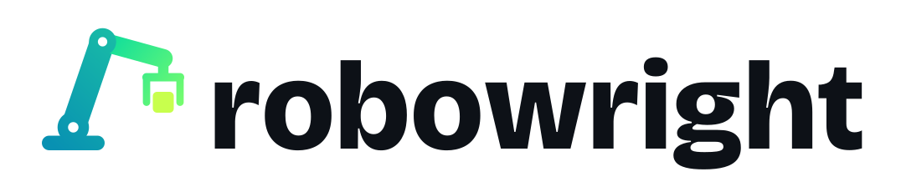
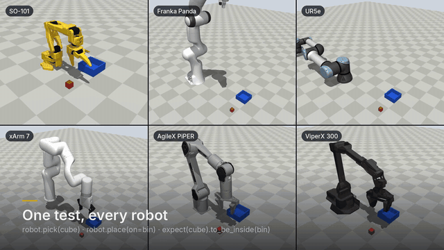

<p align="center">
  <picture>
    <source media="(prefers-color-scheme: dark)" srcset="docs/logo-dark.svg">
    
  </picture>
</p>

<h3 align="center">Playwright-style testing for robot software.<br>Your controller, policy or ROS 2 stack drives the robot. robowright watches, asserts and keeps the evidence.</h3>

<p align="center">
  <a href="https://github.com/JeremiahM37/robowright/actions/workflows/ci.yml"></a>
  
  <a href="LICENSE"></a>
  
  
</p>

<p align="center">
  <a href="#quickstart-60-seconds">Quickstart</a> &middot;
  <a href="#which-engine">Engines</a> &middot;
  <a href="#robots">Robots</a> &middot;
  <a href="#a-tour">Tour</a> &middot;
  <a href="#traces-replay-codegen">Traces</a> &middot;
  <a href="#troubleshooting">Troubleshooting</a> &middot;
  <a href="CONTRIBUTING.md">Contributing</a>
</p>

<p align="center"></p>

In Playwright, your web app is what is under test and the browser is real. robowright works the
same way for robots: **your code drives the robot**, in a physics engine, in Gazebo or on the real
arm over ROS 2, and the test **only observes and asserts**. Assertions retry until the physical
world catches up; every failure leaves a **trace** you can scrub through, a bit-for-bit
**replay** and a generated **regression test**. Pre-alpha (see [Limitations](#limitations)).

## Quickstart (60 seconds)

You need [uv](https://docs.astral.sh/uv/) (or plain `pip`) and Python 3.10+. No GPU and no model
download: the default robot (SO-101) and engine (MuJoCo) ship with the package.

```bash
uv venv && source .venv/bin/activate
uv pip install "robowright @ git+https://github.com/JeremiahM37/robowright"   # or: pip install "git+https://github.com/JeremiahM37/robowright"
robowright info                                    # sanity check: versions, engines, offscreen rendering
```

### Test your controller or policy

A policy is anything that maps an observation to joint targets: a function, a class, or a
trained model (`LearnedPolicy` loads ONNX, TorchScript, LeRobot and other checkpoints). The test
hands the robot to it and judges the outcome:

```python
# test_my_controller.py
from robowright import condition, expect
from robowright.policies import ScriptedPickPlace as MyController  # stand-in: import yours


def test_my_controller_puts_the_cube_in_the_bin(robot, scene):
    done = condition(scene["cube"], "to_be_inside", scene["bin"])
    rollout = robot.run_policy(MyController(), until=done, hold=1.0, timeout=15)
    assert rollout.success, rollout
    expect(scene["cube"]).to_be_at_rest()
```

```bash
pytest test_my_controller.py --rw-trace on       # the SO-101 in MuJoCo: about a second
pytest test_my_controller.py --rw-live            # watch it live in a browser as it runs
robowright show-trace robowright-traces/*.zip --no-open -o trace.html
```

The same file runs on other robots and engines (`--rw-robot panda,ur5e`, `--rw-backend
mujoco,drake`), and a policy is judged as a rate across randomized scenes with
`@pytest.mark.trials(20, min_success=0.9)`.

### Test your ROS 2 stack

robowright serves its simulation as a ROS 2 robot (`/joint_states`, `/clock`, TF for the objects,
`FollowJointTrajectory` and `GripperCommand` actions, the forward controller's topic), so the
stack you run on the real arm drives it unchanged. The test starts your stack and watches:

```python
def test_my_stack_puts_the_cube_in_the_bin(scene, ros2):
    with ros2.run("ros2 launch my_robot pick.launch.py use_sim_time:=true"):
        expect(scene["cube"]).to_be_inside(scene["bin"], timeout=60)
```

[`examples/ros2_stack/pick_node.py`](examples/ros2_stack/pick_node.py) is a stand-in stack (TF,
an IK library, the two actions) and [`tests/test_ros2_bridge.py`](tests/test_ros2_bridge.py)
tests it that way. `robowright sim --ros2 --live` serves a simulation on its own, for you or
an agent to drive by hand.

### Then the same tests against Gazebo or the real arm

`--rw-backend ros2` points the same tests at any robot behind ROS 2: a real arm with a
`ros2_control` driver, Gazebo through `gz_ros2_control`, or Isaac Sim's bridge. robowright
changes nothing in the robot; it reads joint states and TF, and sends commands only if the
test asks it to.

The whole stack can be someone else's. [`tests/test_moveit_gazebo.py`](tests/test_moveit_gazebo.py)
runs Universal Robots' own Gazebo simulation of a UR5e (`ur_simulation_gz`: UR's description,
`gz_ros2_control`, UR's `scaled_joint_trajectory_controller`) and MoveIt (`ur_moveit_config`).
The code under test is other projects' too, run as published: [pymoveit2](https://github.com/AndrejOrsula/pymoveit2)'s
`ex_pose_goal.py` asks `move_group` for poses, and UR's own `example_move.py` (from
`ur_robot_driver`) sends trajectories straight to UR's controller. robowright loads UR's
description as it is (no gripper added), watches on Gazebo's clock without sending a command,
and asserts where the arm ended up:

```python
ur = robots.load("ur_description/urdf/ur.urdf.xacro?ur_type=ur5e&name=ur", gripper=False, base_pos=(0, 0, 0))
w = rw.launch(
    SceneSpec(robot=ur.name, objects=[]), backend="ros2", command=False, frame="base_link", gripper={"interface": "none"}, use_sim_time=True
)
goal = ["-p", "position:=[0.4, 0.2, 0.4]", "-p", "quat_xyzw:=[1.0, 0.0, 0.0, 0.0]", "-p", "use_sim_time:=true"]
with subprocess.Popen(["python", "pymoveit2/examples/ex_pose_goal.py", "--ros-args", *goal]):  # your MoveIt code
    expect(w.robot.tcp).to_be_near((0.4, 0.2, 0.4), tol=0.002, timeout=45, hold=0.5)
```

A target 4 cm off fails the test even though MoveIt reports success, and robowright's model of
the arm agrees with the robot's own TF to under half a millimetre. Running it found problems
in every layer:

- **robowright:** the ROS clock read 0 until Gazebo's first `/clock`, so a test's timeout could
  expire before anything moved; every arm was assumed to have a gripper; a Gazebo step
  could return with the world still reported running (Gazebo unpauses it to step, and about a
  third of the time the message with the last step says so); a model just removed could come
  back from a pose message already in flight; and with DISPLAY set to an X server without GLX
  (a virtual one), MuJoCo picked GLX and every render failed (robowright now uses EGL there).
- **pymoveit2:** it reads the robot's URDF and SRDF from `move_group`'s parameters, and UR's
  MoveIt configuration hands them over on topics instead, so none of its examples could start
  ("Invalid response from 'move_group/get_parameters'"). Fixed in
  [`scripts/patches/`](scripts/patches/pymoveit2-robot-description-topics.patch) (applied by
  `scripts/ros2_env.sh`, with tests in pymoveit2's own suite).
- **The cell, as UR ships it:** MoveIt failed 14 to 18 of every 40 plans for the test's poses,
  each failure after its full 10 s. Every UR joint but the elbow is allowed two full turns, and
  the simulated cell has a floor 1 cm under the base. KDL, MoveIt's IK solver here, returned shoulder angles a turn away
  from the arm's, poses only reachable by swinging the upper arm through that floor, so no plan
  existed (40 of 40 plans to one such goal failed). A floor-mounted cell holds the shoulder lift
  above the floor, which UR's description takes as a joint-limits file; with it, no time-outs.
  Of the plans left, 2.5% (15 of 600) failed MoveIt's own check of the finished path (the
  forearm through the wrist), because OMPL checks motions at 0.5% of a joint space this large;
  checked at 0.05%, 600 of 600 plans were found. And MoveIt's floor (UR's) is 1 cm below
  Gazebo's, a centimetre MoveIt would move the arm through and Gazebo would not; pymoveit2's
  collision example adds Gazebo's to MoveIt's scene. Moves were also started before UR's launch
  had finished loading its controllers, and the controller manager skips the hardware while it
  loads one; the rig now waits for every spawner. These settings are in
  [`tests/ur_moveit_rig.py`](tests/ur_moveit_rig.py), through UR's, MoveIt's and pymoveit2's own
  parameters, with UR's packages otherwise as shipped.
- **ros2_control, in simulation:** now and then UR's controller aborted a move
  (`PATH_TOLERANCE_VIOLATED`): the arm stopped dead for a quarter of a second while the
  trajectory ran ahead of it. The controller manager, on sim time, gives controllers the time
  of its own ROS clock, which is the last `/clock` message it received (bridged from Gazebo by
  another process), and not the time of the step `gz_ros2_control` calls it for. When `/clock`
  arrives late, controller time stands still while Gazebo runs on, then jumps. Found with
  probes in the running Gazebo (every physics step had its hardware write; Gazebo never
  paused) and the controller's own commands; with the machine loaded, UR's own example was
  aborted 7 times in 60. Given the step's time instead
  ([`scripts/patches/`](scripts/patches/ros2_control-sim-time-argument.patch), built and
  preloaded by `scripts/ros2_env.sh` and the rig), 0 in 60, through `/clock` stalls of up to
  2.5 s. Reported upstream
  ([ros2_control#3683](https://github.com/ros-controls/ros2_control/issues/3683)), with the fix
  proposed in [#3684](https://github.com/ros-controls/ros2_control/pull/3684).

In Gazebo, robowright can also **drive the simulator**, the way Playwright drives a browser
(`[ros2] gazebo = true`, [`robowright.gazebo`](src/robowright/gazebo.py)): objects' positions are
Gazebo's own, the scene's objects are spawned into the world, `world.move_object` and the trials'
scene randomization move them there, it pauses Gazebo and steps it an exact number of physics
iterations, and screenshots are Gazebo's rendering from cameras it adds to the world.

### What a passing test tells you

A pass in simulation says: *this code did this task on this robot model in this engine.* It
does not say the real arm will. robowright keeps that gap visible instead of tuning it away:

- **The robot is its model file as published** (`--rw-fidelity published`, the default), plus
  only values with a cited source, such as a gripper's rated force from its datasheet. Every
  other change robowright makes is recorded in the run, by kind: a **repair** the file needs
  to simulate at all, the **interface** robowright drives it through (one rule for every robot),
  or a translation for another engine. `robowright fidelity --robot panda --backend drake` lists
  them, and every trace and report carries them.
- **robowright's own tuning is opt-in.** `--rw-fidelity adjusted` adds what it once used to make
  more tests pass: stiffer contacts, capped grippers, stiffened servos, an integral term under a
  policy's commands. More robots pass with it, on physics nobody measured.
- **Engines disagree, and that is information.** `--rw-backend mujoco,drake` and `robowright
  crosscheck` run the same test on another contact model; where only one engine passes, the
  result depends on the engine, not on your code. Where an engine or a published model cannot
  do a task, the [registry of known divergences](conftest.py) says why, measured.
- **Some interfaces are kinder than real hardware.** Every simulated arm's weight is cancelled,
  as industrial controllers do; hobby-servo arms (the SO-101, Koch) do not do that.
- **Hardware is the ground truth.** `--rw-backend ros2` runs the same test on the real arm. So
  far that has been tested against `ros2_control` on mock hardware, against robowright's own
  simulation behind ROS 2, and against Gazebo, but not yet on a physical robot.

### robowright's own controller

`robot.pick(cube)` and `robot.place(on=bin)` are robowright's reference controller: they wait
for the arm to settle, plan around the table and check the grasp. Use them to set up a
situation (hand an object to the robot, move it somewhere) or to try a robot model out; a test
that only calls them tests robowright, not your code.

```python
from robowright import expect


def test_the_reference_controller_on_every_robot(robot, scene):
    cube, bin = scene["cube"], scene["bin"]
    robot.pick(cube)
    expect(robot.gripper).to_be_holding(cube)
    robot.place(on=bin)
    expect(cube).to_be_inside(bin)
```

<p align="center"></p>

The same test runs unchanged on a Franka Panda, a UR5e with a Robotiq gripper, a Kinova
Gen3, a KUKA iiwa, an xArm 7, ALOHA's ViperX, the Bridge WidowX, a PiPER, a YAM, an ARX L5,
a Sawyer and the LeRobot SO-101, and on any other arm from its model file (MJCF, URDF or
xacro: `--rw-robot path/to/arm.urdf`): robowright works out which joints are the arm, which
parts are the fingers, how the gripper opens and where to mount it, from the model itself.
See [Any robot, from its model file](#any-robot-from-its-model-file).

<p align="center"></p>

For a whole project, `robowright init` writes an example test, `pytest.ini`, `robowright.toml`, a
GitHub Actions workflow and `.mcp.json` (so AI coding agents get the robot tools), and
`pytest --rw-report report.html` gives the run as one HTML page.


## Why

Most robot software is tested by running it and watching. The tools that exist each cover
one slice of the problem:

- `launch_testing` checks that processes start and exit.
- Benchmark suites such as LIBERO and ManiSkill score policies on fixed tasks.
- Rerun and Foxglove record and visualise runs, but have no notion of pass or fail.

None of them gives you what web developers have had for years: a test that says what
should happen, waits for it, fails with a clear explanation, and leaves behind enough
evidence to debug it. robowright brings that workflow to robots:

| Playwright | robowright |
|---|---|
| your app is under test, in a real browser | your controller, policy (`robot.run_policy`) or ROS 2 stack (the `ros2` fixture) drives the robot, in an engine, in Gazebo or on the arm (`--rw-backend ros2`) |
| auto-waiting actions | `robot.arm.move_to(...)` returns only once the arm has settled; `gripper.close()` returns once the jaws have stalled |
| web-first assertions | `expect(cube).to_be_inside(bin)` re-checks every control step until it holds or times out, in *simulated* time |
| locators | `scene["cube"]`, `scene.get(color="red")`, `scene.nearest(to=robot.tcp)` are live handles, not snapshots |
| trace viewer | every failure leaves a `.zip` trace with joints, object poses, contacts and the action timeline, viewable as HTML with camera views drawn from it |
| codegen | `robowright codegen trace.zip` rebuilds the exact failing situation as a pytest test |
| projects (browsers) | `--rw-backend mujoco,drake` and `--rw-robot panda,ur5e` run every test on each engine and robot |
| `npm init playwright` | `robowright init`: an example test, settings, a CI workflow, and the MCP server registered for AI agents |
| HTML reporter | `pytest --rw-report report.html`: every test, each failure with its trace as text and in the viewer |
| `--headed`, UI mode | `pytest --rw-live`: watch each test live in a browser (camera, joints, contacts, the current action); `--rw-headed`: MuJoCo's own window |
| Playwright MCP, test agents | `robowright mcp`: an agent runs your policy or starts your ROS 2 stack against a robot, watches, asserts, saves a test, runs the suite and reads each failure's trace |

On top of that, it adds things robots need and web pages don't:

- **Statistical tests:** a policy that works 92% of the time is normal. `@pytest.mark.trials(20, min_success=0.9)` runs 20 differently randomized scenes and judges the rate, with confidence intervals.
- **Fault injection:** sensor noise, command latency, weak servos, shoves and camera dropout, all seeded.
- **Invariants:** `expect(robot).always.to_have_no_collisions()` is checked after every step.
- **Deterministic replay:** re-simulates a trace from its recorded motor commands and reports the first step where anything diverges.

## Robots

| name | robot | maker | kind | joints | model licence |
|---|---|---|---|---|---|
| `so101` | SO-101 | TheRobotStudio / Hugging Face | arm | 5 | Apache-2.0 |
| `panda` | Franka Emika Panda | Franka Robotics | arm | 7 | Apache-2.0 |
| `ur5e` | Universal Robots UR5e + Robotiq 2F-85 | Universal Robots | arm | 6 | BSD (arm, gripper) |
| `ur10e` | Universal Robots UR10e + Robotiq 2F-85 | Universal Robots | arm | 6 | BSD (arm, gripper) |
| `gen3` | Kinova Gen3 + Robotiq 2F-85 | Kinova | arm | 7 | BSD (arm, gripper) |
| `iiwa14` | KUKA LBR iiwa 14 + Robotiq 2F-85 | KUKA | arm | 7 | BSD-3-Clause (arm), BSD (gripper) |
| `xarm7` | UFACTORY xArm 7 | UFACTORY | arm | 7 | BSD |
| `vx300s` | Trossen ViperX 300 S (ALOHA) | Trossen Robotics | arm | 6 | BSD |
| `wx250s` | Trossen WidowX 250 S (Bridge) | Trossen Robotics | arm | 6 | BSD |
| `piper` | AgileX PiPER | AgileX Robotics | arm | 6 | MIT |
| `yam` | I2RT YAM | I2RT | arm | 6 | MIT |
| `arx_l5` | ARX L5 | ARX | arm | 6 | BSD-3-Clause |
| `sawyer` | Rethink Sawyer + Robotiq 2F-85 | Rethink Robotics | arm | 7 | Apache-2.0 (arm), BSD (gripper) |
| `go2` | Unitree Go2 | Unitree Robotics | quadruped | 12 | BSD |
| `go1` | Unitree Go1 | Unitree Robotics | quadruped | 12 | BSD-3-Clause |
| `a1` | Unitree A1 | Unitree Robotics | quadruped | 12 | BSD-3-Clause |
| `spot` | Boston Dynamics Spot | Boston Dynamics | quadruped | 12 | BSD-3-Clause |
| `anymal_c` | ANYbotics ANYmal C | ANYbotics | quadruped | 12 | BSD |
| `g1` | Unitree G1 | Unitree Robotics | humanoid | 29 | BSD |

```console
$ robowright robots                              # this list
$ pytest --rw-robot panda,ur5e                   # pick robots
$ pytest --rw-robot all                          # every arm
$ pytest --rw-robot legged                       # every legged robot
```

### Any robot, from its model file

The robots above are not special: point `--rw-robot` at any arm's model file, MJCF or URDF, and
the same tests run on it.

```console
$ robowright robots --inspect path/to/my_arm.urdf   # what robowright makes of it, and why
$ pytest --rw-robot path/to/my_arm.urdf             # every robot test, on that robot
```

A model file describes every robot the same way (bodies, joints, actuators), but not what the
parts are for. robowright reads that off the model, the way Playwright finds a button by its
role:

- **The gripper** is the actuator that moves several coupled joints, a slide, or parts named
  like a gripper, at the end of the chain. Its **hand** is the body its joints hang from, and the
  **arm** is every actuated joint between the base and the hand.
- **The fingers** are the two moving parts that reach furthest along the tool axis and close
  towards each other, or one moving jaw against the hand (SO-100, SO-101, Koch). **Open** is
  whichever end of the gripper's range leaves them further apart.
- **Mounting:** the arm is placed (and turned, if its model faces another way) where top-down
  grasps reach the whole task area, with no part of its base standing where objects go or
  within 4 cm of a cube, where an open gripper comes down beside it. An arm whose zero pose lies
  in the table starts in its home pose instead.
- **Home, and every top-down reach,** is the IK solution nearest the arm's pose that keeps the
  hand out of the arm and its base. A redundant or unlimited arm can reach a point folded into
  itself (the e.DO's first home put its gripper 1 cm into its forearm, the wrist servo pushing
  at its limit); then robowright looks from other starting poses for one that does not.
- **A bare arm** gets a Robotiq 2F-85 on its flange, facing along the last joint's axis. A
  model with no site there gets it at the last link.
- **A mobile manipulator** (a free-floating base with a gripper and no legs, such as TIAGo) has
  its base held where it stands, and its arm is tested as on a fixed one. If its arm cannot
  reach the task area from anywhere that way (Stretch reaches along one line), its base drives
  instead: a joint forward and one turning in place. IK moves them a tenth as readily as the
  arm's joints, so the arm reaches first and the base drives for the rest.
- **An arm with no wrist roll** (four joints, say) grips at whatever angle it reaches with.
- **Joints that move together** (Stretch's telescope: four slides kept in step by the model's
  constraints, driven through one tendon) are one arm joint; its partners move with it, on
  every engine: a coupler constraint in Drake, a mimic joint in Genesis and Isaac Sim, a motor
  per segment in PyBullet (where geared, nested segments shuffled against each other).
- **A hand with several fingers**, each with motors of its own at the base and the tip (the
  three-finger Kinova Jaco), closes as one: every finger joint follows one finger's base joint,
  through a nearly rigid constraint. (MuJoCo's default softness scales with the mass it moves:
  on light fingers the first finger swept the cube away ahead of the others.)
- **Models that need adapting:**
  - fingers with a motor each are made to follow one, which gets their force together;
  - a force-motor gripper becomes a position servo;
  - an Euler-integrated model whose servos would oscillate runs `implicitfast`;
  - a force-limited joint too light to integrate stably gets the motor inertia the model left out;
  - a model on MuJoCo's default friction (a pyramidal cone, impratio 1), under which a held
    object creeps out of the fingers, gets the elliptic cone and impratio 10 that MuJoCo's own
    gripper models use;
  - a gripper whose fingers stop on each other well short of its closed command (Stretch's tips
    meet a seventh of the way along) reads closed where they meet;
  - a lift or telescope whose servo the joint's dry friction could stall more than 1 mm from a
    target (Stretch's lift: 4 mm) is stiffened to stall within 1 mm.

**URDF** is read with MuJoCo's own URDF reader, plus what it cannot do on its own:

- `package://` mesh paths are found the way ROS finds them: `ROS_PACKAGE_PATH`, then the
  directories around the file.
- COLLADA meshes are converted to OBJ.
- A URDF names no motors, so each joint gets a position servo that reaches its `effort` limit
  0.02 rad (2 mm on a slide) from its target. Where the file gives no effort, or an obvious
  placeholder (1000 N m on a hobby servo), the effort is twice what holding up and accelerating
  the arm and 1.5 kg needs. Geared joints get the motor inertia their stiffness needs to
  integrate stably.
- `<mimic>` joints follow their leader. The links collide with the world but not with each
  other, as PyBullet treats a URDF.
- Every engine collides a mesh as its convex hull. Where a gripper mesh's hull would fill the
  space between the jaws (an L-shaped fixed jaw), that mesh is split into convex parts with
  CoACD. A finger whose inner face is a pocket for a rubber pad keeps its hull, which stands in
  for the pad.

**xacro** templates are expanded on the way in, `$(find pkg)` resolved like `package://`. Their
arguments follow the path after a `?`, or go in `xacro_args`:

```console
$ pytest --rw-robot "ur_description/urdf/ur.urdf.xacro?ur_type=ur5e&name=ur5e"
```

`pip install -e ".[urdf]"` brings the tools (trimesh, pycollada, CoACD, xacro). Without them,
COLLADA visuals are left out and concave jaws stay hulls, both with a warning, and a xacro file
is refused with how to expand it by hand.

Each decision is listed by `--inspect`. `robowright robots add my_arm.xml --name my_arm`
gives the robot a name in the project's `robowright.toml`, where any decision can be
overridden, and detection works from what is given (a model whose gripper range is a
placeholder full turn, say, is read once `gripper_open` and `gripper_closed` say where it
opens):

```toml
[robots.my_arm]                      # then: pytest --rw-robot my_arm
file = "my_arm.xml"
grip_force = 40.0
home = [0.2, 0.0, 0.12]
```

In code, `robots.load("my_arm.xml", grip_force=40.0, home=(0.2, 0.0, 0.12))` does the same.

A model's servos are taken as they are, soft or stiff. robowright times each of its own moves so
the servos can follow it (a soft servo lags by its inertia over its stiffness times the move's
acceleration), on MuJoCo leads them along it by their damping lag (kv/kp, as a trajectory
controller does), and asks a joint that stops short under load for the difference (an integral
term; in simulation only: a robot behind ROS 2 has its own controllers). A test that asks a robot to pick up something wider than its gripper opens is skipped on
that robot, saying so, rather than failed.

**Measured:** re-detected from their bare model files, all 19 built-in robots come out as their
hand-written entries say. On robots robowright had never seen, the arm contract and examples
(21 tests) on MuJoCo:

| From MJCF (MuJoCo Menagerie robots that aren't built in) | Result |
|---|---|
| Franka FR3, FR3 v2, Flexiv Rizon 4, UFACTORY Lite 6 (with the 2F-85), ALOHA's arm, SO-100, Koch low-cost arm | all 21 pass |
| PAL TIAGo and TIAGo Dual (base held) | all 21 pass |
| Hello Robot Stretch 3 (base drives, telescope as one joint) | all 21 pass, and on Drake; all 20 that run on Isaac Sim (rendering is off there) and all 19 on PyBullet (it has no state save there). On Genesis too, since robowright gives Genesis an elliptic friction cone (with its default pyramidal one the cube slid out of its rounded rubber pads as it lifted). The side grasp is skipped: holding its gripper level, it reaches no lower than 11.5 cm |
| Unitree Z1 | 17 of 21; the 3 that carry the cube to the bin (and 1 example) are registered limits (strict xfails, `conftest.py`): its moving jaw swings from a pivot 9 cm up, so at a 25 mm cube the jaws stand 13 degrees apart, closer at the top, and wedge the cube downward with ~9 N. It picks, lifts and survives a shove, but MuJoCo's friction creeps under that load (0.5-1.5 mm/s, whatever the contact stiffness, noslip or impratio) and the cube slides off the pads on the way to the bin |
| Lite 6, narrow gripper | 12 mm gap: every test that picks the 25 mm cube is skipped, saying so; the rest pass |
| Google Robot | all 21 pass: its servos are soft (time constants to 1 s) and sag under gravity and joint friction; robowright times its moves to them and adds an integral term, as a controller would |
| TidyBot (arm on a mobile base modelled as slides) | all 21 pass |
| Trossen AI | every motor capped at ±1 rad in the model; refused: no mounting reaches the task area |
| Hello Robot Stretch 2 | refused: its standard gripper has no wrist pitch, so it cannot point down for a top-down grasp |
| Legged robots (ANYmal B, Barkour, H1, T1, OP3, Apollo, TALOS, N1, Cassie, ToddlerBot, G1 with hands, Spot with its arm...) | detected as quadrupeds or humanoids: chains of actuated joints reach the ground, so hands do not make them mobile manipulators |

| From URDF (ROS description packages, PyBullet's and Drake's models) | Result |
|---|---|
| Franka Panda (two URDFs), KUKA LBR iiwa (three), AgileX PiPER, SO-100, Unitree Z1, I2RT YAM, UFACTORY xArm 6 with gripper, Comau e.DO (every joint unlimited, no effort given) | all 21 pass |
| SO-101, Fanuc M-710iC | all 21 pass |
| OpenMANIPULATOR-X | all 21 pass |
| OpenMANIPULATOR-X follower (OMX-F) | refused until given `gripper_open` and `gripper_closed`: its gripper range is a placeholder full turn |

| From xacro (ROS 2 description packages, with their arguments) | Result |
|---|---|
| UR5e, UR10e, Franka FR3, UFACTORY xArm 6 and xArm 7, Kinova Gen3 and Gen3 lite, Flexiv MICO-Core, Flexiv Rizon 4, Kinova Jaco 2 (three fingers) | all 21 pass |

On the other engines, the URDF arms pass the arm contract 182/182 on PyBullet, 210/210 on
Drake and 210/210 on Genesis. The OpenMANIPULATOR-X used to miss on PyBullet: the gear constraint
tying its two sliding jaws corrected no drift, so squeezing a cube they parted 17 mm and lifted
without it. It now corrects 80% a step, and the jaws squeeze 20 N. The xArm 6's linkage gripper,
driven through one joint, once failed on Genesis: given twice its force, the knuckle closed on past
where its pads had stopped until the linkage's mimic coupling gave way, and the cube slid out. A
driver behind a linkage now gets the force it was measured at, Genesis holds the couplings rigid
(as robowright holds MuJoCo's), and grippers close at 0.7 s a stroke (faster, its pads met the
cube hard enough to pop it out upwards). Among the
Menagerie arms, SO-100, Koch, FR3 and FR3 v2 pass on PyBullet and Drake. Genesis passes
SO-100, FR3 and FR3 v2; the Koch's jaws close through the cube there, touching nothing.

Models come from [MuJoCo Menagerie](https://github.com/google-deepmind/mujoco_menagerie),
fetched on first use (a sparse checkout of just the robots you run, pinned to one commit),
except the SO-101, which ships with robowright. They keep their own licences. Robots
without a gripper of their own (UR5e, UR10e, Gen3, iiwa, Sawyer) get a Robotiq 2F-85.

Each arm is mounted where its top-down workspace covers the same task area, so a test's
coordinates mean the same thing on every robot. Everything else is derived from the model,
not hand-tuned:

- **Tool axis and TCP:** read from the finger geometry, with the TCP placed where the fingers close.
- **Fingertip clearance:** how low a grasp can go before the fingertips touch the table.
- **Gripper calibration:** every finger joint's open and closed position, plus which joints the
  actuator drives and which follow through a linkage. Engines without MuJoCo's tendons and
  equality constraints need this to move the fingers the same way.

## Legged robots

```python
def test_go2_recovers_from_a_shove(world, robot):
    expect(robot.base).always.to_be_upright(tol_deg=30)  # invariant: never tips over
    world.faults.push("robot", force=(0, 0.3 * robot.total_mass * 9.81, 0), duration=0.1)
    world.wait(1.5)
    expect(robot.base).to_be_upright(tol_deg=10)
    expect(robot.base).to_be_above(0.8 * robot.model.stand_height)
```

`robot.base` is a live handle like any object: position, orientation, velocity, contacts.
`robot.stand()`, `robot.crouch(depth)` and `robot.move_joints(q)` wait until the robot
settles. Policies get what an IMU and joint encoders give a real robot (`base_quat`,
`base_ang_vel`, `qpos`, `qvel`). There is no walking controller built in: walking is a
policy's job, run with `robot.run_policy(...)`. Unitree H1 and Booster T1 are not on the
list because neither can stand on joint servos alone, without a balance controller.

## Install

robowright isn't on PyPI yet. From source:

```bash
pip install "git+https://github.com/JeremiahM37/robowright"      # core: MuJoCo, the SO-101, pytest plugin, trace viewer
```

To work on robowright itself: `git clone https://github.com/JeremiahM37/robowright && cd robowright && pip install -e ".[dev]"`
(MuJoCo, xdist, ruff and the test tools; any Python 3.10-3.13, no compiler). Add PyBullet with
`pip install -e ".[dev,pybullet]"`; without it the PyBullet tests skip.

### Which engine?

| Engine | Install | Python | Notes |
|---|---|---|---|
| **MuJoCo** (default) | included | 3.10+ | Fastest; draws the trace views. Start here. |
| **PyBullet** | `pip install "robowright[pybullet]"` | 3.10+ (3.12+ builds it, see below) | Light, CPU only. A good second engine for cross-checks. |
| **Drake** | `pip install "robowright[drake]"` | **3.12+** | Different contact model; catches engine-specific passes. |
| **Genesis** | install [PyTorch](https://pytorch.org) first, then `pip install "robowright[genesis]"` | 3.10+ | Heavy (torch); CPU or CUDA. |
| **Isaac Sim** | not a pip extra, see below | 3.11 | NVIDIA GPU only. |

(When installing from git, write the extra as `"robowright[pybullet] @ git+https://github.com/JeremiahM37/robowright"`.)
Other extras: `[mcp]` (let an AI agent drive a simulated robot), `[urdf]` (mesh tools for
reading URDFs: COLLADA, concave jaws, xacro), `[video]` (`robowright render` to mp4), `[onnx]` (ONNX policies).

Then, in your own project:

```bash
robowright init                  # an example test, pytest.ini, robowright.toml, a GitHub Actions
                                 # workflow, and .mcp.json so AI coding agents get the robot tools
pytest                           # run it
```

Robot models other than the SO-101 are downloaded from MuJoCo Menagerie the first time a
test uses them, into `~/.cache/robowright` (or `$XDG_CACHE_HOME/robowright`): a sparse
checkout of just the robots you run, 30-40 MB each. This needs `git` and network access once.

**Isaac Sim** (NVIDIA GPU machines only): install Isaac Sim 5.x
(`pip install "isaacsim[all,extscache]==5.1.0" --extra-index-url https://pypi.nvidia.com`
into a Python 3.11 environment), set `OMNI_KIT_ACCEPT_EULA=YES`, then install robowright
into the same environment and use `--rw-backend isaac`. Its URDF importer needs
`libxml2.so.2` (on Arch-based systems, the `libxml2-legacy` package).

### Troubleshooting

| Symptom | Fix |
|---|---|
| `the 'pybullet' engine is not installed: pip install "robowright[pybullet]"` | The engine's extra is missing. Install the extra named in the message; `robowright info` lists the engines you have. |
| `[pybullet]` takes a minute and runs a compiler, or fails with `Python.h: No such file` | PyBullet publishes wheels only up to Python 3.11, so on 3.12 and 3.13 pip builds it from source. That needs a C++ compiler and the Python headers. Install the headers for your Python (`sudo apt install python3.13-dev`, or `python3.12-dev`), or use a uv-managed Python, which ships them: `uv venv --python 3.13 --python-preference only-managed`. Or use Python 3.10 or 3.11, which get a prebuilt wheel. Checked on 3.13: the build fails with the system Python lacking headers and succeeds with uv's. |
| Drake is unavailable | Drake wheels need Python 3.12+. Create the venv with `uv venv --python 3.12`. |
| `offscreen rendering: unavailable` in `robowright info` | Tests still pass and traces still record; the viewer just has no camera picture. On headless Linux install Mesa EGL (`sudo apt install libegl1 libgl1 libgles2 libosmesa6`) and set `MUJOCO_GL=egl`. |
| `show-trace` does nothing on a server | It opens a browser. Use `--no-open -o trace.html` and open the file. |
| A robot model fails to download | It needs `git` and network on first use. Make sure `~/.cache/robowright` is writable, delete the half-finished robot folder and re-run. |
| No trace after a passing test | Traces are kept on failure by default. Add `--rw-trace on`. |
| Genesis import errors | Install a working `torch` (CPU or CUDA) before the `[genesis]` extra. |
| `externally-managed-environment` from pip | Use a venv: `uv venv && source .venv/bin/activate`. |

## A tour

### Actions wait

```python
robot.arm.move_to((0.22, 0.05, 0.04))  # IK, joint-space trajectory, then wait until settled
robot.arm.move_to(cube, linear=True, speed=0.05)  # straight-line Cartesian approach
robot.gripper.close()  # returns when the jaws stop: on an object, or shut
robot.pick(cube)  # returns once the cube is held in both jaws after the lift
robot.place(on=bin)  # into the bin's centre, or the free spot farthest from what is already there
robot.pick(can, approach="side")  # a tall object, from the side: a planned path, then straight in
robot.pick(can, approach=(1, 0, -1))  # coming in along a direction: here 45 degrees down, along +x
robot.arm.move_to(point, plan=True)  # round the table and the objects, not through them
```

Moves interpolate joints, which is safe while the hand comes from above. A side grasp (or any
move with `plan=True`) plans instead: collisions are checked on a MuJoCo copy of the scene,
with the objects where the simulation has them and anything held carried along, whatever
engine runs it; the search is RRT-Connect in joint space from a seeded generator (the same
scene plans the same path), then shortcut. Before a side grasp moves at all it checks every
part of it - the way in, the straight moves in and up, a smooth IK solution with no joint
flipping at a limit - and tries other directions round the object, or says why none works.
On the built-in arms, a 10 cm can picked from the side and set in a bin works on 7 of 13
(Panda, UR5e, UR10e, xArm 7, Gen3, ViperX, Sawyer) on MuJoCo, PyBullet, Drake and Isaac Sim; the iiwa,
PiPER, SO-101, YAM and ARX cannot hold the hand level beside it from where they are mounted,
and the WidowX's gripper opens 4 mm wider than the can. On Genesis the can once crept out of
the xArm 7's fingers mid-carry, until robowright gave Genesis an elliptic friction cone, which
holds under a steady load where its default pyramidal one slips; the Robotiq-gripped arms hold it since Genesis
holds the gripper linkages' couplings rigid.

A grasp can come in at any angle between level and straight down, the fingers closing level:
`approach=(1, 0, -1)` comes in at 45 degrees. It plans and checks its moves as a side grasp
does, and sets the object down with the tilted hand's lowest point clear of the surface. At 45
degrees, a can and a cube are picked and set in a bin by the UR5e, UR10e, xArm 7, Gen3 and
Sawyer on MuJoCo; the Panda's grip lets the can slip as it starts to carry it, and the iiwa and
SO-101 cannot reach that way from where they are mounted.

Jaws that swing rather than slide (Stretch's fingers) can reach further down
part-open than shut. A top-down `pick` opens them fully, as it always has, unless held off the
table that way they would close above a short object; then they open only as wide as the object
needs (7.5 mm to spare each side) and come down lower. `place` lets go at the same opening,
high enough that fingertips which dip as they open (the Jaco's, by 3 cm) clear the surface.

When an action can't finish, it says why:

```
ActionTimeoutError: arm did not settle within 1.0s; worst joint shoulder_lift is 0.408 rad off target
UnreachableError: no joint configuration reaches [0.5, 0.0, 0.3] (closest 264.6 mm)
GraspError: pick('cube2') lifted without it: cube2 is at [0.151, -0.086, 0.012], the tool at [0.161, -0.1, 0.066], the jaws at opening 0.11, touching nothing / nothing
```

### Assertions wait, then explain

```python
expect(cube).to_be_inside(bin)  # retries for up to 2 s of simulated time
expect(cube).to_be_at_rest(hold=0.3)  # ...and must stay true for 0.3 s
expect(robot.gripper).to_be_holding(cube)  # both jaws in contact
expect(cube).not_.to_be_touching("floor")
expect(robot).always.to_have_no_collisions()  # invariant for the rest of the test
expect.soft(cube).to_be_upright()  # record and keep going; fail at the end
```

```
ExpectationError: expect(cube).to_be_inside failed after 2.00s (timeout 2.0s)
  cube at (0.256, -0.102, 0.012); bin spans (0.150, 0.070, 0.000)..(0.250, 0.170, 0.040)
```

Time spent waiting is *simulated* time, so a 2-second timeout costs a few milliseconds of
wall time, and a condition that is already true costs nothing.

Matchers: `to_be_near`, `to_be_inside`, `to_be_above`, `to_have_position`, `to_be_at_rest`,
`to_be_upright`, `to_be_touching`, `to_be_holding`, `to_be_open`, `to_be_closed`,
`to_have_joint`, `to_have_no_collisions`, `to_satisfy(fn)`.

### Policies are first-class

Any callable `obs -> joint targets` is a policy, including action chunks (`(n, 6)` arrays),
which is how ACT- and diffusion-style policies emit actions:

```python
from robowright import condition

done = condition(scene["cube"], "to_be_inside", scene["bin"])
rollout = robot.run_policy(my_policy, until=done, timeout=15, cameras=("front",))
assert rollout.success
```

### Learned policies, whatever trained them

A trained model speaks its own conventions: its observation keys, image layout, joint order
and units, gripper range, normalisation and chunk length. `LearnedPolicy` translates, so any
checkpoint runs in `run_policy` on every robot and engine:

```python
from robowright.learned import LearnedPolicy

policy = LearnedPolicy(
    "checkpoints/pick.onnx",  # or .pt2 / TorchScript, a torch.nn.Module, any callable,
    images=["front"],  # "module:name", or "loader:reference" from a plugin
    units="deg",  # joints in degrees, as the dataset recorded them
    gripper=(0, 100),  # the model's closed and open values
    normalize="checkpoints/stats.json",
)
rollout = robot.run_policy(policy, task="put the cube in the bin", until=done)
```

The model can be a PyTorch module, anything with `select_action(batch)` (the convention
LeRobot and others follow), an ONNX or `torch.export` file, or a model a framework's
`robowright.policies` plugin loads from its own checkpoint format (`"name:reference"`).
robowright depends on none of them. A project can name its policies in `robowright.toml`
(`[policies.NAME]`), and a generated regression test recreates the policy by that name.

[`examples/test_learned_policy.py`](examples/test_learned_policy.py) tests a real one: a small
network trained by imitation ([`scripts/train_pick_policy.py`](scripts/train_pick_policy.py)),
exported to ONNX, in degrees and with its gripper from 0 to 100. The test requires 20/20. Each
version was measured on 40 seeds or more per engine (the bold cells are where it fell short):

| how it was trained | MuJoCo | PyBullet | Drake | Genesis | Isaac Sim |
|---|---|---|---|---|---|
| cloned from MuJoCo demonstrations | 32/40 | **2/40** | | | |
| cloned from MuJoCo and PyBullet | **31/40** | **37/40** | **17/20** | **12/20** | **8/20** |
| DAgger, on four engines (the example) | 140/140 | 140/140 | 140/140 | 140/140 | 40/40 |

Running every engine is what found each problem:

- **A sim-to-sim gap.** Trained on one engine's demonstrations, it failed on the other:
  PyBullet's servos trail their targets further while moving (7.5 mrad against 2.5 at the 90th
  percentile), and the policy had never seen those states.
- **A wait the policy could not see.** The demonstrator paused for a fixed time after closing
  and after opening the gripper. To a policy that sees no clock, "wait" and "go" were the same
  state; it averaged them and stalled holding the cube. The demonstrator now closes slowly, and
  the policy reads the targets it last commanded (the `"target"` state feature), so how far a
  close has got is something it can see.
- **Drift with no way back.** A cloned policy drifts into states its demonstrator never
  visited. DAgger runs the policy and has the demonstrator label every state the policy
  reaches, and the policy trains on those labels too. That only worked once the demonstrator
  decided from what it sees rather than from a remembered step of its plan. A policy cuts
  corners: it heads straight down to the cube without stopping above it. A demonstrator still
  waiting at the waypoint it skipped told it to go back up, from the very spot where it had
  shown closing the gripper, and the retrained policy did neither.

Isaac Sim was never in its training data and it succeeds there every time too.

### Statistics instead of flakes

```python
@pytest.mark.trials(20)  # 20 seeds, every one must pass; min_success=0.9 would accept 18
def test_policy_with_randomized_cube(world, robot, scene):
    world.faults.jitter("cube", xy_std=0.02, yaw_std=0.5)
    ...
```

```
================================ robowright trials =================================
PASS examples/test_pick_and_place.py::test_policy_with_randomized_cube[mujoco]: 20/20 passed (100%, 95% CI 84%-100%); required rate >= 100%
```

Each trial gets its own seed, and the seed decides the scene. Before every trial each free
object resting on the table is moved to a random pose near where the scene puts it: up to
1.5 cm along each table axis and turned up to 45 degrees (for a cube, every yaw it can have).
Bins stay put, objects stacked on, under or inside another are left alone, and no two objects
are pushed into each other. A `jitter` in the test replaces that move rather than adding to it,
so the test above sees exactly the 2 cm spread it asks for.

That default is small on purpose: it makes trials different runs, not a model of your
deployment. The physics is deterministic, so without it 20 trials would be one run repeated
and a "95% CI 84%-100%" would mean nothing. For a rate that means something about the real
robot, randomize what varies there: wider `jitter`, `joint_noise`, `action_delay`,
`camera_dropout`, `push` (see Faults). `randomize=False` turns the default off; if nothing
else in the test draws from the seed, robowright warns that its trials were one run repeated
and says so in the trials summary instead of presenting the rate as evidence.

A failing trial keeps its own trace, and its seed is printed, so you can rerun exactly that
one. Trials stop once the rest cannot change the verdict
(with `min_success=0.9`, 18 passes of 20 already meet it and 3 failures already miss it), so
the verdict is always the one all 20 would give. `--rw-all-trials` runs every one, for a rate
measured on all of them.

The examples require every trial, on every robot and engine. When they accepted less, each
seed that failed had a cause worth finding. Under encoder noise the scripted policy waited
over the bin until it timed out: 0.02 rad on a 1.3 m UR10e is 2.6 cm at the tool, and one
reading rarely lands within its 1.2 cm tolerance, so it now averages the readings taken while
it holds still. On the Panda in PyBullet the cube turned in the fingers while they squeezed
(0.5 rad after 1.8 s) and slipped out: re-checking the arm's position under noise was keeping
the jaws closed on it longer.

### Faults

```python
world.faults.joint_noise(std=0.02)  # encoder noise, seen by robot and policy, not by physics
world.faults.action_delay(steps=3)  # 60 ms command latency
world.faults.weak_joint("shoulder_lift", 0.3)  # a tired servo
world.faults.push("cube", force=(0, 1.5, 0), duration=0.1)
world.faults.camera_dropout(p=0.1)
world.faults.jitter("cube", xy_std=0.02)  # domain randomisation, seeded
```

### Traces, replay, codegen

With the default `--rw-trace retain-on-failure`, every failing test leaves a trace:

```
================================ robowright traces =================================
tests/test_bin.py::test_cube_lands_in_bin[mujoco]
    robowright show-trace robowright-traces/tests_test_bin.py__test_cube_lands_in_bin[mujoco].zip
```

<p align="center"></p>

`pytest --rw-trace-text` (or `robowright show-trace --text trace.zip`) prints a trace as
text, for a CI log or an AI agent:

```
tests/test_tidy.py::test_cube_goes_in_the_bin[mujoco]: FAILED
  so101 on mujoco, seed 0, 197 steps (3.94 s simulated)
timeline:
      0.00-2.04s  robot.pick(obj=cube)
      2.04-3.44s  robot.place(on=[0.25, -0.1, 0])
  ✗   3.94s  expect(cube).to_be_inside(container=bin, margin=0, timeout=0.5)
        cube at (0.250, -0.100, 0.012); bin spans (0.150, 0.070, 0.000)..(0.250, 0.170, 0.040)
at the failure (t=3.94 s, step 197):
  joints: shoulder_pan=0.452, shoulder_lift=0.340, elbow_flex=-0.203, wrist_flex=1.434, wrist_roll=0.502, gripper=1.000
  cube: at (0.250, -0.100, 0.012), yaw 0 deg
  bin: at (0.200, 0.120, 0.000), yaw 0 deg
  contacts: floor-cube 0.29 N
```

`pytest --rw-report report.html` writes one page for the whole run, Playwright's HTML
report: every test with its outcome and time, trials with their rates, and each failure
with its message, its trace as text and a link to it in the viewer. `pytest --rw-headed`
shows each test in MuJoCo's own window as it runs, at real-time pace.

The viewer is one self-contained HTML file, so you can attach it to a CI run or an issue.
It has an action list, a scrubbable camera view, a timeline, joint plots (measured against
commanded), and per-step joints, objects and contacts.

Tests don't render anything while they run. A trace records each step's joints, object
poses and (for legged robots) base pose. When a trace is opened, the scene is rebuilt in
MuJoCo and drawn from that recorded state, with no physics. So only the runs someone
looks at pay for pictures. Rendering frames during a run used to roughly double a test's
time (+80% to +119% on a pick-and-place); recording state alone costs 2–13%. Traces from
engines that can't render, such as Isaac Sim here, are drawn the same way.

```console
$ robowright render trace.zip -o run.mp4 --size 1280x720    # every step, at the run's own pace
```

To keep what the cameras saw during the run instead, for example the images a policy was
given, pass `Settings(trace_cameras=["front"])`.

```console
$ robowright replay trace.zip
replayed 223 steps: bit-identical

$ robowright codegen trace.zip -o tests/test_regression_bin.py
```

`replay` rebuilds the scene, restores the saved simulator state and feeds back the
recorded motor commands and forces. No test code runs. If anything diverges, it reports
the first step where it does. `codegen` writes the run back out as plain robowright code.
That includes the exact randomised start poses and injected faults, so a one-in-fifty
failure becomes a test you can run every time.

### AI agents drive robots over MCP

Playwright MCP lets an agent use a browser, with your app in it. `robowright mcp` lets one use a
robot the same way, with your code driving it: it runs your policy (`robot_run_policy
"my_pkg.control:Pick"`), or serves the simulation over ROS 2 (`robot_serve_ros2`) and starts your
stack (`robot_start_process "ros2 launch my_robot pick.launch.py"`), lets time pass, and checks
what happened (`robot_expect`). It can send raw joint targets and step time
(`robot_set_targets`, `robot_step`), connect to Gazebo or a real arm (`robot_launch
backend="ros2"`), and give you a URL to watch it live (`robot_watch`). With a robot in Gazebo
(`ros2={"gazebo": true}`) it drives the simulator itself: `sim_pause`, `sim_play`, `sim_step`
(exact physics iterations), `sim_spawn`, `sim_remove`, `sim_state`, with `robot_move_object`
moving Gazebo's models and `robot_screenshot` returning Gazebo's own rendering.

```console
$ claude mcp add robowright -- robowright mcp
```

The agent launches a world (any robot, any installed engine, its own objects) and reads it
as text:

```
world: Franka Emika Panda (panda) on mujoco, t=6.540s, seed=0, status=running
robot (arm):
  tcp: [0.300, 0.400, 0.166]
  gripper: opening 1.00 (open), holding nothing
  joints: joint1=0.503, joint2=0.711, joint3=0.109, joint4=-1.452, joint5=-0.086, joint6=2.159, joint7=-0.152, gripper=1.000
objects (refs for other calls):
  - cube: red box 40x40x40 mm, at [0.300, 0.401, 0.066], yaw 0 deg, at rest, inside bin, touching bin
  - cylinder: green cylinder 30x30x40 mm, at [0.450, 0.150, 0.020], yaw 0 deg, at rest, touching floor
  - bin: blue bin 200x200x80 mm, at [0.300, 0.400, 0.040], yaw 0 deg, touching cube
cameras: front, top, side
```

It sets situations up with robowright's reference controller (`robot_pick`, `robot_place`,
`robot_move_to`), disturbs them (`robot_push`, `robot_fault`, ...), checks outcomes with any
matcher (`robot_expect`), and looks through
the cameras (`robot_screenshot`). Each action returns the new snapshot. A failed action
explains itself and the session carries on. `robot_generate_test` writes the session out
as a pytest test that reproduces it bit for bit:

- Attempts that failed during planning, before anything moved, are left out.
- Failed attempts that let simulated time pass are kept inside `pytest.raises`, so the
  rest of the test happens at the same simulated times.

Given only these tools and the task "put a cube and a cylinder in the bin with a Panda,
verify it, save a test", a headless Claude agent built the scene, did it on the first
try, checked a screenshot and saved a test that passes.

An agent can also work on a project's tests the way Playwright's test agents do.
`robot_run_tests` runs them and returns each failure with its trace as text: what ran,
which expectation failed and why, and where the robot and every object were at that
moment. `robot_read_trace` reads any trace the same way. Given a project with a test that
set the cube down beside the bin, and told only "make it pass without weakening the
assertion", a headless Claude agent ran it, read that the cube was 17 cm from the bin,
changed `place(on=(0.25, -0.1, 0))` to `place(on=scene["bin"])` and confirmed it passed:
10 turns, $0.13. (Its first try, a point in the middle of the bin, found a robowright bug:
a point inside a bin was carried at table height and caught on the rim. Points now clear
whatever they lie over.) A session costs what MuJoCo
costs: about 1 second of wall time for a launch, pick, place, check and screenshot.

### Cross-check on another engine

A run that passes on one engine may only pass because of that engine's contact model.
`crosscheck` makes a trace's calls again on another engine, from the same scene and seed,
and compares the verdict and where each object ended up:

Here a WidowX 250 holds a cube, a 6 N push leans on it for half a second, and the test
expects it still held. MuJoCo's contacts keep it (up to an 8 N push); Drake's let it go from
5 N, and the push, still acting on the freed cube, throws it across the floor:

```console
$ robowright crosscheck widowx_push.zip --backend drake
drake: fails (ExpectationError: expect(gripper).to_be_holding failed after 2.00s (timeout 2.0s)); on mujoco it passed
  cube ends 110259.1 mm from where it did on mujoco
VERDICTS DIFFER: the outcome depends on the engine
```

The intended workflow:
- Develop and iterate on MuJoCo, where a pick-and-place takes a fraction of a second.
- Cross-check what matters on a heavier engine, such as Isaac Sim's PhysX on a GPU machine.

Agents can do the same with the `robot_crosscheck` MCP tool.

### Several physics engines

```console
$ pytest --rw-backend mujoco,pybullet,drake,genesis,isaac
```

| engine | install | notes |
|---|---|---|
| MuJoCo | included | the reference: robots run exactly as their Menagerie authors tuned them |
| PyBullet | `pip install robowright[pybullet]` | Bullet, the long-standing open-source baseline |
| Drake | `pip install robowright[drake]` (Python 3.12+) | Toyota Research Institute's simulator; SAP contact solver, soft-surface contact |
| Genesis | `pip install robowright[genesis]` | CPU by default (faster than CUDA for one scene, and deterministic); `ROBOWRIGHT_GENESIS_DEVICE=gpu` |
| Isaac Sim | install Isaac Sim 5.x into the environment | NVIDIA PhysX 5; needs an NVIDIA GPU machine. CPU PhysX pipeline by default (deterministic, ~17× faster than the GPU pipeline for one scene); physics only; its traces are drawn by MuJoCo from the recorded state |

The robot, kinematics, actions and assertions are shared; only physics differs. Every
engine loads the same description of each robot: a URDF and OBJ meshes exported from its
MuJoCo model, plus a sidecar for what URDF can't express (servo gains, armature, finger
calibration, joints that move together, excluded collision pairs). URDF has no joint springs,
so a spring the gripper never moves (Stretch's rubber fingertip pads, which give a little
where they touch) is welded on the other engines: held by soft constraints or motors in its
place, the pads folded under the squeeze. Each backend has to pass the same contract
(`robowright check`, the tests in `robowright.contract`) on every robot before it ships.

### Robots behind ROS 2

`--rw-backend ros2` runs the same tests on any robot with a ROS 2 driver, real or simulated
(Gazebo, Isaac Sim's ROS bridge), through the standard `ros2_control` interfaces:

```toml
# robowright.toml
[ros2]
arm = { controller = "forward_position_controller", interface = "position" }   # or a joint_trajectory_controller
gripper = { controller = "gripper_controller", interface = "action" }          # GripperCommand, or with the arm
joints = { shoulder_pan = "joint1" }      # where the driver's names differ
objects = { cube = "cube", bin = "bin" }  # TF frames: what object assertions read
cameras = { front = "/camera/image_raw" } # image topics: what policies see
command = true                            # false: observe only, for a robot your own stack drives
```

On a real arm, start with `command = false`: robowright then reads joint states and TF and never
sends a command, and any action that would move the robot fails at once. [docs/hardware.md](docs/hardware.md)
is the order to bring an arm up in. Give robowright the robot's own description, as the driver
has it: `robots.load("my_arm.urdf.xacro", gripper=False)` for an arm with no gripper (otherwise a
gripperless arm gets a Robotiq 2F-85, as robowright's own simulations do).

With `gazebo = true` (or `{ world = "name" }`) robowright also talks to Gazebo itself, over its
transport rather than ROS 2 ([`robowright.gazebo`](src/robowright/gazebo.py), Gazebo Harmonic):
object poses become Gazebo's ground truth (TF stays what your stack's perception sees), the
scene's objects are spawned into the world if missing, and `move_object`, trial randomization,
pause, exact stepping, spawning, removing and camera images act on the simulator.

The other direction works too: `Ros2Bridge` (the `ros2` fixture, `robowright sim --ros2`) serves
robowright's simulation as a ROS 2 robot, so your stack drives it while the test watches, with
ground truth, contacts, faults and traces as in any test, and each goal your stack sent in the
trace's timeline. And against a third-party simulator: [`tests/test_gazebo.py`](tests/test_gazebo.py)
spawns robowright's URDF export of the SO-101 in Gazebo (gz sim, DART) with `gz_ros2_control`
and `ros2_control`'s stock controllers, bridges the objects' poses to TF, and runs the same
moves and pick-and-place through `--rw-backend ros2`: robowright only talks to it over ROS 2.

Joints come from `/joint_states`, targets go to the controllers each control step on the ROS
clock, objects come from TF, and grasps are judged from the jaws (told to close, stopped on
something, the object in the hand), since a real gripper has no contact sensor. It claims none
of the simulator capabilities, so the contract skips ground truth, contacts and state restore
and runs the rest. Tested on ROS 2 Jazzy against `ros2_control`'s own controllers on mock
hardware (forward position, joint trajectory, gripper action) and against a simulated arm
behind the same topics, where the pick-and-place test above, the learned policy and the
contract pass unchanged (`tests/test_ros2.py`).

A test that passes on one engine and fails on another usually means the behaviour depends
on contact details that no engine models faithfully. Those cases are kept visible, not
tuned away: [`conftest.py`](conftest.py) lists each known divergence as a strict expected
failure with the measured reason, so CI fails the day one starts passing.

## The matrix: every robot on every engine

`python bench/matrix.py` runs the same randomised pick-and-place on every (engine, arm)
pair, 20 seeds each (cube position σ = 15 mm, yaw σ = 0.6 rad, the same seeds in every
column), plus standing and push recovery for the legged robots, with each robot as its model
file has it (fidelity *published*). Every number is measured; the full tables are in
[MATRIX.md](MATRIX.md).

| robot | MuJoCo | PyBullet | Drake | Genesis | Isaac Sim |
|---|---:|---:|---:|---:|---:|
| SO-101 | 20/20 | **11/20** | **8/20** | 20/20 | 20/20 |
| Franka Emika Panda | 20/20 | 20/20 | 20/20 | 20/20 | 20/20 |
| Universal Robots UR5e + Robotiq 2F-85 | 20/20 | 20/20 | 20/20 | 20/20 | 20/20 |
| Universal Robots UR10e + Robotiq 2F-85 | 20/20 | 20/20 | 20/20 | 20/20 | 20/20 |
| Kinova Gen3 + Robotiq 2F-85 | 20/20 | 20/20 | 20/20 | 20/20 | 20/20 |
| KUKA LBR iiwa 14 + Robotiq 2F-85 | 20/20 | 20/20 | 20/20 | 20/20 | 20/20 |
| UFACTORY xArm 7 | 20/20 | **5/20** | 20/20 | 20/20 | 20/20 |
| Trossen ViperX 300 S (ALOHA) | 20/20 | 20/20 | 20/20 | 20/20 | 20/20 |
| Trossen WidowX 250 S (Bridge) | 20/20 | 20/20 | 20/20 | 20/20 | 20/20 |
| AgileX PiPER | 20/20 | 20/20 | 20/20 | **19/20** | 20/20 |
| I2RT YAM | 20/20 | 20/20 | 20/20 | 20/20 | 20/20 |
| ARX L5 | 20/20 | 20/20 | **12/20** | 20/20 | 20/20 |
| Rethink Sawyer + Robotiq 2F-85 | 20/20 | 20/20 | 20/20 | 20/20 | 20/20 |
| *legged: stands, and recovers from a sideways shove of 0.56–1.62× body weight* | 6/6 | 6/6 | 6/6 | 6/6 | 6/6 |

60 of the 65 arm cells are 20/20. The five that are not are the engines and models disagreeing,
measured and left visible:

- **SO-101 on PyBullet (11/20) and Drake (8/20).** The SO-101's modelled gripper presses a cube
  with about 65 N in MuJoCo, the servo's full torque at the jaw. PyBullet's rigid contacts push
  the cube 9 mm into the fixed jaw's 2 mm pad plates under that and sometimes squeeze it out;
  with Drake's default contact stiffness the placed cube chatters on the bin floor and never
  rests. MuJoCo's soft contacts, Genesis and Isaac Sim hold it.
- **xArm 7 on PyBullet (5/20).** PyBullet has no closed kinematic chains, so the xArm Gripper's
  four-bar linkage runs as a motor on each passive joint, and at its rated 30 N the jaws close
  unevenly and push the cube aside.
- **ARX L5 on Drake (12/20), PiPER on Genesis (19/20).** Drake's default contact again (the placed
  cube does not settle); one of twenty PiPER grasps in Genesis loses the cube.

With robowright's own tuning (`--rw-fidelity adjusted`: a 30 N cap on unrated grippers, stiffer
Drake contact, the integral term under policies) every cell was 20/20; that run is
`bench/results/matrix_adjusted.json`. The tuning is still there, off by default, because those
values were chosen to make tests pass, not measured on the robots.

What running everything on everything turned up:

- **Bugs in robowright, not the engines.** The first full run had the KUKA iiwa at 8/20
  *in MuJoCo*, the reference, and dropping the cube 100–150 mm from MuJoCo's spot in every
  other engine. Traces showed four causes, all in robowright, not the engines:
  - the redundant arm's IK let the elbow drift during straight-line moves;
  - the IK picked a symmetric grasp yaw that needed more wrist turning than necessary;
  - `place()` turned the wrist under load;
  - `place()` crossed 8 mm above the bin's rim.

  All four are fixed; every arm is now 20/20 in MuJoCo, Drake and Isaac Sim.
- **Gripper models are far from their datasheets.** Menagerie's Franka Hand presses each jaw
  with 0.6 N against a 70 N spec, its PiPER with 0.25 N against 40 N, and its xArm Gripper with
  about 140 N against 30 N. Where the maker publishes a figure (Franka, UFACTORY, AgileX),
  robowright drives the gripper at it, the way real grippers work: a stiff servo whose force
  limit is the datasheet's. Closing the model on a block converts that jaw force into an
  actuator force, whatever the transmission. Every engine then presses within 15% of the
  datasheet (`test_grip_force_matches_the_datasheet`). PyBullet has no closed kinematic chains,
  so the xArm's six-joint linkage pressed 13.7 N there until the backend measured its own
  squeeze on a block and scaled the driver to match. Without a datasheet, a measured or vendor
  figure is used: the ViperX's 12.8 N measured at the tip (ALOHA 2, Fig. 4), the WidowX's 4.7 N
  (the same gripper scaled by its servo's stall torque), the YAM's 50 N (the force its SDK limits
  a blocked gripper to) and the ARX L5's 10 N (Menagerie's actuator limit, under its SDK's
  1.5 N m cut-out). Modelled, they pressed 0.9–5.4 N, and a 1.5 N shove knocked the cube out on
  every engine; at these forces it holds on all five. The PiPER went from 0/20 to 20/20 in
  PyBullet once it pressed at its rated 40 N instead of 0.25 N.
- **Contact models disagree by millimetres.** Same robot, same seed, same commands: Genesis,
  Isaac Sim and Drake put the cube within 1 mm of MuJoCo's final position on about half the
  arms. Genesis stays within 7 mm on every arm; Isaac Sim within 8 mm on all but the PiPER
  (12 mm); Drake within 9 mm on all but the PiPER (13 mm) and the Panda (19 mm); PyBullet
  within 0.6–14 mm.
- **With robowright's tuning, every arm passed on every engine (65 of 65).** Some of those
  failures were robowright's own bugs, found and fixed (the next two findings); others were
  tuned around, and with the robots as published they are back (the table above).
- **Genesis's last two failures were the same staircase.** The iiwa's Robotiq 2F-85 let the
  cube slide out in transport (15/20) and the PiPER's jaws knocked it away as they closed
  (14/20, each a `GraspError`), recorded as Genesis's soft mimic constraint. Traced per
  substep: the PiPER's gripper servo, stiff enough to close at the datasheet's 40 N, jerked
  its driven finger at every control step, and the finger tied to it by the mimic constraint
  rang at about 50 Hz, ±4 mm, striking the cube on its inward swings. Stiffening the mimic
  made it worse (0/9 seeds), and MuJoCo's second finger lags just as much, so the lag was
  never the cause. Ramping the arm's and gripper's targets across the substeps fixed both:
  20/20 each, at a median 11% more time per step (5–25%; nothing extra while holding still).
  Their two registry entries left. Genesis's xArm grip, at 25.6 N just inside the 15%, was a
  third robowright bug: a driver servo without gains of its own was given a gain that reached
  its force cap a quarter of the travel off target, and the cube stopped the jaws 22% off, so
  it pushed 1.41 of its 1.57 N·m. Datasheet grippers now saturate within 5% of the travel:
  28.8 N, against MuJoCo's 28.5 N.
- **"PyBullet's contacts let weak grips slip" was robowright's bug.** The matrix had PyBullet
  dropping the cube from the ARX L5 every time and from the YAM a quarter of the time, and the
  divergence registry blamed its contact model. Measured, PyBullet pressed *harder* than MuJoCo
  (0.88 N per pad against 0.25 N), held the cube perfectly while still, and held it lifting at
  1 cm/s. Two things in robowright's PyBullet backend were dropping it:
  - The arm moved in a staircase. A PyBullet position motor closes a fixed fraction of its
    error per substep, so a new target each control step made the arm leap to several times
    the commanded speed and coast (27 m/s² peak against MuJoCo's 5, same policy); the light
    grip lost contact on every leap. Targets are now ramped across the substeps with velocity
    feed-forward, as a servo's interpolator does.
  - The second sliding finger was a separate motor told to follow the first. With both at
    their force limit nothing kept the pair centred, so a sideways load slid fingers and cube
    along the jaw together until one finger hit its stop. Sliding fingers are now tied by a
    gear constraint, as MuJoCo's joint equality and Genesis's and Isaac Sim's mimic joints tie
    them. Revolute linkages keep following by motor: geared, the Robotiq 2F-85's jammed open.

  The ARX L5 went from 0/20 to 20/20 and the YAM from 15/20 to 20/20; PyBullet now agrees with
  MuJoCo on every arm, and all eight "weak grip" entries left the registry. A model of MuJoCo's
  kp/kv servo per joint was tried first and dropped: without the coupling between joints it
  overshot on the light SO-101 and knocked cubes aside (8/12 policy runs; 12/12 with the ramp).
- **Every engine is now handed the same commands.** The staircase above is now smoothed in
  one place (`TargetRamp`) for all five engines: each control step's change of servo targets
  is spread across its physics substeps, as a servo's interpolator does, so MuJoCo, Drake and
  Isaac Sim, whose softer servos had been smoothing the steps themselves, see the same
  ramped targets as PyBullet and Genesis. It changes nothing while the robot holds still and
  costs nothing then. PyBullet's finger motors keep stepped targets, since they already close
  at a capped pace. The one test it moved was MuJoCo's ViperX under a shove: its modelled grip
  chatters between 0 and 1.9 N on the cube, and whether a 1.5 N shove knocks the cube out
  depends on where in that chatter it lands (it lets go anywhere from 1.25 to 1.55 N). It now
  lands on the losing side, as it already did on Drake. Driven at the 12.8 N measured on the real
  gripper, it no longer chatters and holds on every engine.
- **Runs are deterministic down to the last bit, wherever they run.** Three things could
  change a run's last digits without changing its inputs, and none can now:
  - Sensor noise, camera dropout and `jitter()` drew from one shared random stream, so a
    regression test generated from a trace (which places the jittered object rather than
    jittering it again) read different encoder noise from the original. Each source now has
    its own seeded stream.
  - On Genesis and Isaac Sim, capturing the state also snaps the simulation onto it (that is
    what makes restores exact), and the state was captured only when tracing. One capture
    more moved Isaac Sim's Go2 by 1.8e-6 within a shove. The state is now captured at the
    same moments in every run, traced or not.
  - A target ramp that ends at `start + (end - start)` misses `end` in the last bit; it now
    lands on it.

  `tests/test_reuse.py` checks that traced and untraced runs, and reused and new scenes
  (below), match bit for bit on every engine with state save/restore.
- **Fixes needed to match MuJoCo:**
  - PyBullet multiplies friction coefficients where MuJoCo takes the larger, and folding
    MuJoCo's armature into PyBullet's link inertia made arms fling held objects.
  - Drake needed soft-surface contact for objects and its "lagged" contact setting to
    keep a resting cube from spinning.
  - Genesis on CPU is 5.6× faster than on an RTX 5080 for a single scene, and Isaac Sim's
    CPU PhysX pipeline 17× faster than its GPU one. GPU physics pays off for thousands of
    parallel scenes, not for one test.
  - Isaac Sim needed PGS instead of PhysX's default TGS solver (TGS let the xArm 7's gripper
    linkage drag its arm joints off target), rigid mimic joints for finger coupling, and
    joint velocities measured from motion, because PhysX reports a clamped jaw as moving.
    Its gripper drives had to be damped for the whole linkage they move, armature included:
    damped for the driver alone, the xArm 7's jaw chattered on a held cube and shook it
    loose whenever a policy lifted quickly (0/20; 20/20 after).
  - Driving grippers at datasheet force found five more problems:
    - The xArm 7's six gripper joints inherit the arm's 1 N·m of joint friction from
      Menagerie's defaults, more than a 30 N gripper can drive.
    - The PiPER couples its second finger through a soft equality constraint. At full force
      that finger lagged and pushed the cube off-centre.
    - In Isaac Sim, every finger joint but the first driver is a mimic joint, and PhysX
      ignores a mimic joint's own drive. That had halved every two-driver gripper: the
      Robotiq 2F-85 pressed 21 N against MuJoCo's 45 N.
    - MuJoCo's implicit integrator counts an actuator's velocity gain even while its force is
      capped, which locked a stiffened Panda hand part-way open.
    - Genesis and PhysX report jitter of a few hundredths per second on a jaw that isn't
      moving, so `gripper.close()` now judges a stall from positions, as an encoder would.
  - Restoring a state saved mid-grasp or mid-stumble replays the same future bit for bit
    on every engine with state save/restore, but only after three fixes:
    - Genesis's state had to carry its solver's warm start and broadphase order.
    - Isaac Sim's float32 pose round trip had to be applied to the live run as well.
    - Drake's simulator had to be re-initialised after a restore.
- **Legged robots agree closely.** Every engine stands all six robots on joint servos, and
  push recovery agrees to within about 0.1× body weight across engines.

### Framework speed

Measured with `python bench/run.py`. Full tables and machine details are in
[BENCHMARKS.md](BENCHMARKS.md).

On the default robot (SO-101), AMD Ryzen AI Max+ 395 (32 threads):

| | MuJoCo | PyBullet | Drake | Genesis |
|---|---:|---:|---:|---:|
| one pick-and-place test (2 actions, 3 assertions) | 163 ms | 220 ms | 1481 ms | 294 ms |
| control steps/s: no tracing / tracing / tracing + camera frames | 28.5k / 18.1k / 4.5k | 6.0k / 5.6k / 535 | 1.7k / 1.4k / 959 | 1.7k / 1.4k / 765 |
| replays of faulted runs that were bit-identical | 20/20 | 20/20 | 20/20 | 20/20 |
| randomised pick-and-place passing (same 50 seeds) | 50/50 | 50/50 | 50/50 | 50/50 |

- **Scene reuse:** building a scene costs more than a short test runs (MuJoCo 0.05–0.14 s
  against 0.05 s for a pick; Drake 0.3–0.4 s against 0.5 s), and restoring a saved state
  takes 0.1 ms. So a closed world's scene is kept (two per process) and restored for the
  next world that needs it, checked bit-for-bit against a new build; `ROBOWRIGHT_REUSE=0`
  turns it off. The pytest plugin orders each module's tests by engine and robot so that
  neighbours share a scene. PyBullet builds every world: its in-memory `restoreState`
  replays the physics bit for bit, but its EGL renderer kept stale link poses (a restored
  YAM's camera frame differed from a new build's). The reuse test compares a final camera
  frame as well as every step's positions.
- **Test run time:** full suite, every arm and legged robot, tests and examples (Isaac Sim
  on a Ryzen 7 9800X3D, the rest on the Ryzen AI Max+ 395 inside a 16-core, 40 GB scope):

  | | before reuse | scene reuse | now: `-n auto`, settled trials |
  |---|---:|---:|---:|
  | Genesis | 1114 s (2 workers) | 319 s (2) | 127 s (7) |
  | Drake | 344 s (4) | 249 s (4) | 91 s (14) |
  | MuJoCo | 53 s (4) | 53 s (4) | 38 s (11) |
  | PyBullet | | | 54 s (14) |
  | Isaac Sim | 607 s (1) | 491 s (2) | 417 s (2) |

  `verify`, which runs all of this but Isaac Sim, went from 316 s to 146 s. What did it:
  - Trials stop once their verdict is settled (above): 18 runs of a 20-trial test, 7 of a
    10-trial one, when they pass.
  - `-n auto` sizes the workers by measured cost per engine (`src/robowright/workers.py`).
    Genesis workers now run torch on one thread: its tensors are a few dozen numbers, and
    with a thread per core each of six workers ran 2.8x slower (bit for bit the same).
  - `--dist loadgroup` never grouped anything: xdist read the groups before the plugin set
    them, so each robot's tests were scattered and rebuilt their scene in every worker
    (Genesis's ARX L5 took 9 s a test). The plugin now marks them first, and starts the
    trials tests first instead of last, where xdist's ordering had left them as the tail.
  - A worker that ran every robot grew to 4.4 GB (MuJoCo). The kinematics model of each arm
    was compiled with its meshes (up to 72 MB, now 0.06 MB, frames bit for bit the same), and
    closed worlds waited in reference cycles for a collection; one before each build keeps a
    worker near 2.7 GB, which is what lets more of them run.
  - PyBullet renders from a second client built at the first picture, so a world that never
    takes one loads without EGL (UR10e: 0.07 s against 0.17 s), and pictures cannot touch the
    physics. Frames are pixel-identical to before.
- **Drake collision hulls:** Drake meshes a collision hull for hydroelastic contact, and a
  hull wrapped around a finely tessellated curve has thousands of faces. The SO-101's moving
  jaw had 6,852, so one grip on the cube became 759 contact polygons and the SO-101 cost
  8.2 ms per control step against 3.2–6.0 ms for the other arms. Drake now gets each hull
  simplified to within 0.05 mm of the full one (from inside; a grasp sinks about 1 mm into
  the cube): 3.8 ms per step, with every matrix cell still 20/20 and the cube's landing
  spot moved by 0.1 mm on the SO-101 and not at all on the other arms.
- **Parallel runs:** 64 randomised tests take 13.1 s on one worker and 4.7 s on four pytest-xdist workers (2.8x).
- **Invariants:** two `expect(...).always` invariants add 14 µs to each 33 µs control step; an IK solve costs 0.35 ms.
- **Fault curves:** the reference policy still passes 20/20 with 0.06 rad of encoder noise, 13/20 at 0.09 rad and 0/20 at 0.12 rad; with the shoulder servo's gain cut to 2% it passes 13/20, at 0.5% 3/20. Those are the curves `@pytest.mark.trials` exists to guard.

## Extending robowright

Robots and engines plug in from outside robowright, with no fork
([docs/extending.md](docs/extending.md)):

```bash
robowright robots add models/my_arm.urdf --name my_arm   # names it in robowright.toml
pytest --rw-robot my_arm                                  # every robot test, on your robot
robowright check --robot my_arm --backend mujoco,drake    # the contract every robot meets
```

- **Your robots, with no code:** a `robowright.toml` (or `[tool.robowright]` in
  `pyproject.toml`) names model files, and sets any field detection gets wrong.
- **Robot packs:** a package with a `robowright.robots` entry point ships robots by name.
- **Engines and hardware:** a package with a `robowright.backends` entry point adds a
  `Backend` (six required methods; the rest is declared as capabilities, and the contract
  skips what a backend does not claim). Robots with a ROS 2 driver need none: `ros2` is built in.
- **Learned policies:** a package with a `robowright.policies` entry point loads a framework's
  checkpoints for `LearnedPolicy("name:reference")`; a project names its own in `robowright.toml`.
- **The contract ships with robowright** (`robowright.contract`), so a robot or engine from
  outside is held to the same tests as the built-in ones.

## How it works

```
 test code ──► Robot / LeggedRobot / expect / locators / faults   (backend-independent core)
                   │  IK on the MJCF model, trajectories, waiting, invariants
                   ▼
               World.step()  ── one 20 ms control period ──► Recorder ──► trace.zip
                   │                                             │
                   ▼                                             ├─► viewer (HTML)
     Backend: MuJoCo | PyBullet | Drake | Genesis | Isaac | ROS 2  ├─► replay
       physics only: joints, servo targets, contacts,            └─► codegen
       render, state save/restore
                   ▲
     robots/: RobotModel (MJCF + a few names) ─► derived TCP, tool axis, gripper calibration
                                              └► URDF + OBJ export for non-MuJoCo engines
```

- Kinematics run on each robot's MJCF model with analytic Jacobians and are shared by all
  backends. Every engine's hand pose agrees with them to within 0.1 mm on every arm
  (`test_kinematics_match_the_simulated_hand`).
- Arms get gravity compensation in every engine, as real arm controllers do; legged robots
  stand on their own weight.
- Backends advertise capabilities (`ground_truth`, `contacts`, `render`, `state`, ...).
  A matcher that needs one fails with a clear message on a backend that lacks it, instead
  of passing silently. On hardware, object poses come from a perception hook:
  `world.perception["cube"] = lambda: (pos, quat)`.
- Anything that changes the world mid-test (teleports, faults, pushes) is written to the
  trace, which is what makes replay and codegen exact.

## Limitations

- **No physical robot yet:** the ROS 2 backend has run against `ros2_control`'s own controllers
  on mock hardware, against robowright's simulation served over ROS 2, against an SO-101 in
  Gazebo, and against Universal Robots' own Gazebo simulation with MoveIt, on Jazzy only. Nothing
  has yet run on a real arm, where timing, a driver's quirks and perception noise will find what
  those could not.
- **A pass is about the model, not the arm:** see [What a passing test tells you](#what-a-passing-test-tells-you).
  Published models are what their makers shipped: several of them fail tests as published
  (the FR3 v2's Euler integrator oscillates, Google Robot's and TIAGo's held cubes creep), and
  engines other than MuJoCo fail some tasks at the models' real gripper forces; each is
  registered with its measured cause.
- **Grasps:** from above, from the side, or tilted between the two, the fingers closing level
  (no grasp that rolls the hand); plain moves interpolate joints without checking for
  collisions (pass `plan=True`). A mobile base drives only where the arm cannot reach
  otherwise, as two idealised joints (no wheel slip).
- **No walking controller:** legged robots stand, crouch and recover from shoves on their
  joint servos; locomotion has to come from a policy.
- **Gripper models:** grippers are driven at a published or measured force (Franka Hand, xArm
  Gripper, PiPER, ViperX, WidowX, YAM, ARX L5; the Robotiq 2F-85's model already squeezes inside
  its 20–235 N range). The SO-101 squeezes as modelled; the WidowX's and ARX's figures are
  derived (see above), not datasheets.
- **Example policies read object poses:** the scripted policy and the trained example both
  take object poses as input (ground truth, or TF behind ROS 2). Camera inputs are translated
  and tested (`tests/test_learned.py`), but no camera-trained example ships.

## Roadmap

Each of these builds on the extension points above, not on any one robot or framework:

1. **A physical robot behind ROS 2:** run the contract on real arms and record what differs
   from simulation as known divergences, as the engines' are.
2. **A camera-trained example policy**, tested on every engine and behind ROS 2.
3. **Locomotion policies** as first-class fixtures (walk a Go2 or G1 one metre, assert it
   stays upright).

## License

Apache-2.0. The bundled SO-101 model (MJCF and meshes) is from
[MuJoCo Menagerie](https://github.com/google-deepmind/mujoco_menagerie), Apache-2.0, based on
[TheRobotStudio/SO-ARM100](https://github.com/TheRobotStudio/SO-ARM100). Other robot models
are downloaded from Menagerie at runtime and keep their own licences (`robowright robots`
lists them). See [NOTICE](NOTICE).
